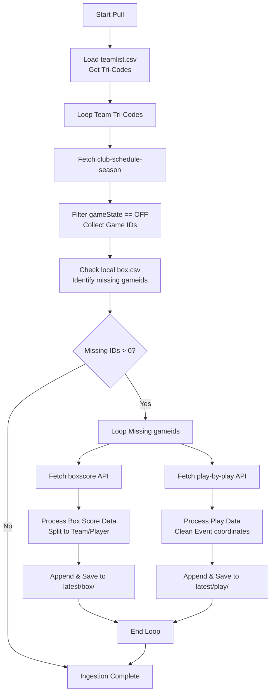

# Skillset 1: NHL Data Ingestion & API Documentation

This skillset documents how the Rinklytics system ingests, cleans, and stores data from the NHL API. It provides a blueprint for LLM agents to write, debug, and understand scripts that query and archive raw statistics.

---

## 1. Scope & Target Measurement Level
* **Measurement Level:** Game Level (Matchups, Scores), Player Level (Individual game box score statistics), Play-by-Play Level (Sequences of events with ticks, coordinates, and types), and Sports Betting Level (Real-time country-stratified moneylines).
* **Storage Location:** 
  * *Local Runtime:* [latest/](file:///Users/jjlee/Documents/GitHub/NHL-Analytics/latest) directory (`box/`, `team/`, `play/`).
  * *Databricks Runtime:* Unity Catalog Volumes (`/Volumes/nhl-databricks/data/` folders: `box/`, `team/`, `play/`, `betting/`).

---

## 2. API Endpoint Architecture
All queries are targeted at the main NHL Web API host: `https://api-web.nhle.com`.

### 2.1 Schedule and Season Game List
* **URL:** `https://api-web.nhle.com/v1/club-schedule-season/{team_abbrev}/{season_idx}`
  * `{team_abbrev}`: Standard 3-letter team tricode (e.g. `BOS`, `MTL`, `VAN`).
  * `{season_idx}`: Joint consecutive years representing the season (e.g. `20232024`, `20242025`).
* **Purpose:** Pulls all game metadata for a team in a season. Filters out future games by selecting records where `gameState == "OFF"` (regular season complete) or `"FINAL"`.

### 2.2 Game Center Box Score
* **URL:** `https://api-web.nhle.com/v1/gamecenter/{gameid}/boxscore`
  * `{gameid}`: Standard 10-digit NHL Game ID (e.g. `2023020204`).
* **Purpose:** Pulls team-level and player-level disaggregated statistics for a completed game.

### 2.3 Play-by-Play (PBP) Event Stream
* **URL:** `https://api-web.nhle.com/v1/gamecenter/{gameid}/play-by-play`
* **Purpose:** Pulls sequential event ticks (hits, shots, goals, penalties, faceoffs) with rink coordinates, timestamps, and skaters in situations.

### 2.4 Real-time Betting Odds
* **URL:** `https://api-web.nhle.com/v1/partner-game/{country_code}/now`
  * `{country_code}`: Country market code, either `US` or `CA`.
* **Purpose:** Pulls current moneylines and odds values provided by betting partners in real time. Because bookmakers refresh lines continuously, this endpoint must be queried and archived regularly during game days.

---

## 3. Ingestion Workflow & Architecture



---

## 4. Input & Output Schemas

### 4.1 Raw API Key Schema Inputs

**Box Score Response Fragment:**
```json
{
  "gameId": 2023020204,
  "gameDate": "2023-11-10",
  "gameType": 2,
  "gameOutcome": { "lastPeriodType": "REG" },
  "homeTeam": { "id": 7, "abbrev": "BUF", "score": 3 },
  "awayTeam": { "id": 30, "abbrev": "MIN", "score": 2 },
  "playerByGameStats": {
    "homeTeam": {
      "forwards": [
        { "playerId": 8479337, "name": { "default": "Tage Thompson" }, "goals": 1, "shots": 4, "hits": 2 }
      ],
      "defense": [],
      "goalies": []
    }
  }
}
```

**Real-time Betting Odds Response Fragment:**
```json
{
  "currentOddsDate": "2026-06-27T12:00:00Z",
  "lastUpdatedUTC": "2026-06-27T11:45:00Z",
  "bettingPartner": { "name": "DraftKings" },
  "games": [
    {
      "gameId": 2025020101,
      "gameType": 2,
      "startTimeUTC": "2026-06-27T23:00:00Z",
      "homeTeam": {
        "id": 7,
        "abbrev": "BUF",
        "odds": [
          { "description": "Moneyline", "value": -150 }
        ]
      },
      "awayTeam": {
        "id": 30,
        "abbrev": "MIN",
        "odds": [
          { "description": "Moneyline", "value": 130 }
        ]
      }
    }
  ]
}
```

### 4.2 Cleaned CSV Database Column Outputs

**Team Boxscore Output (`{year}_box_team.csv`):**
* Index: `gameIdx` (Format: `{team_for}_{team_against}_{gameDate}`)
* Columns:
  * `team_tri` (str): Tri-code of the focal team.
  * `gameid` (int): 10-digit game identifier.
  * `teamloc` (str): `"home"` or `"away"`.
  * `goals` (int): Number of goals scored.
  * `goals_pp` (int): Power-play goals scored.
  * `shots` (int): Total shots on goal.
  * `shots_blocked` (int): Total shots blocked by defenders.
  * `poss_giveaway` (int): Total giveaways.
  * `poss_takeaway` (int): Total takeaways.
  * `win` (int): `1` if focal team won, `0` otherwise.
  * `seasonIdx` (int): NHL season identifier.
  * `gameDate` (datetime): UTC Game date.
  * `gameEnd` (str): `"REG"`, `"OT"`, or `"SO"`.

---

## 5. Generalized Ingestion Implementation
This Python block handles the core schedule fetching and incremental boxscore archiving.

```python
import os
import time
import datetime
import requests
import pandas as pd

def ingest_incremental_boxscores(box_dir: str, team_list_path: str, season_year: int):
    """
    Incrementally pulls boxscore data from api-web.nhle.com.
    """
    # 1. Load team abbreviations
    if not os.path.exists(team_list_path):
        raise FileNotFoundError(f"Missing team configuration: {team_list_path}")
    team_df = pd.read_csv(team_list_path)
    
    # 2. Get list of all completed games for the season
    season_code = f"{season_year}{season_year + 1}"
    all_games = []
    
    for tricode in team_df['tricode']:
        try:
            url = f"https://api-web.nhle.com/v1/club-schedule-season/{tricode}/{season_code}"
            res = requests.get(url, timeout=10)
            if res.status_code == 200:
                games_data = res.json().get('games', [])
                games_df = pd.json_normalize(games_data)
                # Filter to games that have finished
                games_df = games_df[games_df['gameState'] == "OFF"]
                all_games.append(games_df)
                print(f"Retrieved schedule records for: {tricode}")
            time.sleep(0.5)
        except Exception as e:
            print(f"Skipping {tricode} schedule due to exception: {e}")
            
    if not all_games:
        print("No schedule records pulled.")
        return
        
    games_master = pd.concat(all_games).drop_duplicates(subset="id")
    
    # 3. Filter to game IDs not yet pulled
    box_team_file = os.path.join(box_dir, f"{season_year}_box_team.csv")
    existing_ids = set()
    if os.path.exists(box_team_file):
        existing_df = pd.read_csv(box_team_file)
        existing_ids = set(existing_df['gameid'].unique())
        
    missing_ids = [gid for gid in games_master['id'] if gid not in existing_ids]
    print(f"Found {len(missing_ids)} new games to pull.")
    
    if not missing_ids:
        print("Database is up to date.")
        return

    new_teams = []
    for game_id in missing_ids:
        try:
            url = f"https://api-web.nhle.com/v1/gamecenter/{game_id}/boxscore"
            res = requests.get(url, timeout=10)
            if res.status_code != 200:
                continue
            data = res.json()
            game_date = data['gameDate']
            game_type = data['gameType']
            last_period = data['gameOutcome']['lastPeriodType']
            
            # Extract home and away stats
            for loc in ['homeTeam', 'awayTeam']:
                opp_loc = 'awayTeam' if loc == 'homeTeam' else 'homeTeam'
                team_data = data[loc]
                opp_data = data[opp_loc]
                
                # Get basic aggregates from player stats
                p_stats = data['playerByGameStats'][loc]
                players = p_stats['forwards'] + p_stats['defense'] + p_stats['goalies']
                df_p = pd.json_normalize(players)
                
                # Sum key features
                hits = df_p['hits'].sum() if 'hits' in df_p else 0
                shots = df_p['shots'].sum() if 'shots' in df_p else 0
                blocked = df_p['blocked'].sum() if 'blocked' in df_p else 0
                giveaways = df_p['giveaways'].sum() if 'giveaways' in df_p else 0
                takeaways = df_p['takeaways'].sum() if 'takeaways' in df_p else 0
                
                win = 1 if team_data['score'] > opp_data['score'] else 0
                
                record = {
                    "gameIdx": f"{team_data['abbrev']}_{opp_data['abbrev']}_{game_date}",
                    "team_tri": team_data['abbrev'],
                    "gameid": game_id,
                    "teamloc": loc[:4], # 'home' or 'away'
                    "goals": team_data['score'],
                    "shots": shots,
                    "shots_blocked": blocked,
                    "poss_giveaway": giveaways,
                    "poss_takeaway": takeaways,
                    "win": win,
                    "seasonIdx": game_type,
                    "gameDate": game_date,
                    "gameEnd": last_period
                }
                new_teams.append(record)
            time.sleep(0.5)
            print(f"Pulled boxscore for game {game_id}")
        except Exception as e:
            print(f"Failed to fetch game {game_id}: {e}")
            
    if new_teams:
        new_df = pd.DataFrame(new_teams)
        if os.path.exists(box_team_file):
            master_df = pd.concat([pd.read_csv(box_team_file), new_df], ignore_index=True)
        else:
            master_df = new_df
        master_df.to_csv(box_team_file, index=False)
        print("Incremental update successfully saved.")
```

---

## 6. Weaknesses, Caveats & Considerations
1. **API Schema Fragility:** The NHL Web API is undocumented and subject to unannounced structural revisions. For example, during the 2024-2025 season, the `data['summary']['teamGameStats']` nested endpoint was retired, forcing the pipeline to sum player box score tables manually to calculate team-level aggregates (`hits`, `blockedShots`, etc.).
2. **Betting Volatility & Time Gaps:** The real-time partner odds endpoint is highly volatile. Unlike box scores which are static after game completion, odds shift minute-by-minute based on betting pool shifts and player lineup adjustments (e.g. starting goalie announcements). Agents must ensure that ELO/betting comparisons align to the exact timestamp of odds collection.
3. **Pre-season vs. Regular Season Discrepancies:** Play-by-play coordinate tracking and skater counts are occasionally incomplete for pre-season games. Standard filters should restrict analytical pipelines to `gameType == 2` (Regular Season) and `gameType == 3` (Playoffs).
