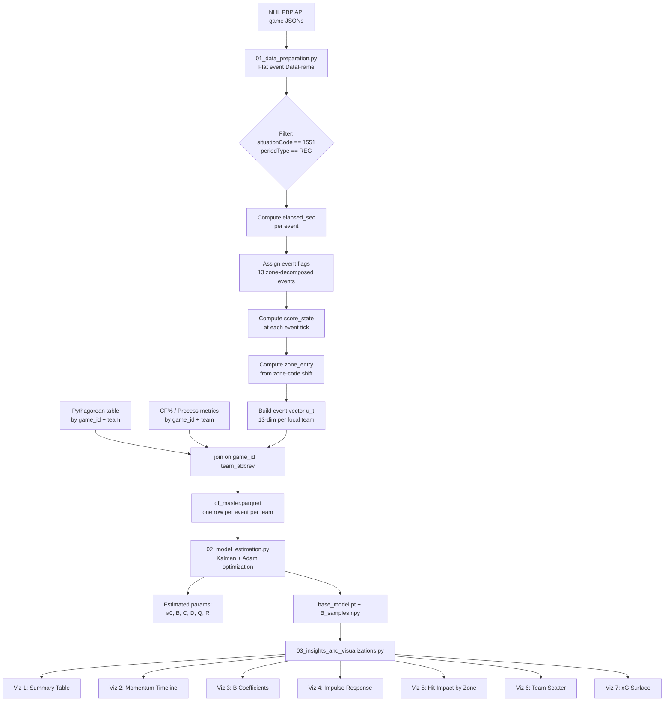

# NHL Momentum State-Space Model
## Quantifying the Value of Physical Play via Latent Momentum Estimation

---

## Table of Contents

1. [Project Overview](#1-project-overview)
2. [Hypotheses](#2-hypotheses)
3. [Data Sources and Schema](#3-data-sources-and-schema)
4. [Data Pipeline and Feature Engineering](#4-data-pipeline-and-feature-engineering)
5. [Team Strength Priors: ELO and Pythagorean Expectation](#5-team-strength-priors-elo-and-pythagorean-expectation)
6. [State-Space Model: Full Specification](#6-state-space-model-full-specification)
7. [Incorporating Team Strength into the Model](#7-incorporating-team-strength-into-the-model)
8. [Estimation Procedure](#8-estimation-procedure)
9. [Parameter Identification and Quantification](#9-parameter-identification-and-quantification)
10. [Analysis Plan](#10-analysis-plan)
11. [Visualizations](#11-visualizations)
12. [Implementation Guide](#12-implementation-guide)
13. [Repository Structure](#13-repository-structure)

---

## 1. Project Overview

This project builds a **continuous-time, event-driven state-space model** to estimate a latent *momentum* state for each NHL team at every play-by-play event tick. The analysis specifically limits its scope to data spanning the **2024-2025** and **2025-2026** NHL seasons. The primary scientific question is:

> **Do physical plays — particularly hits — produce statistically meaningful and durable momentum shifts, or is their apparent effect explained by team quality, score state, and possession-based events?**

A key modeling challenge is that NHL teams vary substantially in quality, and this quality is not fixed — it evolves over the season as rosters change and teams find form. A raw correlation between hits and wins is confounded if better teams systematically hit more (or less) than weaker ones. This model addresses that confounding by incorporating **running ELO ratings** and **Pythagorean win expectation** (via Databricks) as time-varying team strength priors that shift the baseline expected momentum and scoring rate for each matchup.

### Why State-Space?

Standard regression treats each event independently. A state-space model instead posits that game events leave a *residual imprint* on an unobserved momentum state that decays over time. This allows us to:

- Estimate the **impulse and half-life** of each event type.
- Distinguish **short-term shocks** (a single hit's 90-second impact) from **long-run drift** (cumulative physical dominance changing a game's trajectory).
- Properly condition on **team quality** at each game day without hardcoding fixed effects that cannot adapt mid-season.

---

## 2. Hypotheses

| ID | Hypothesis | Test |
|----|-----------|------|
| H1 | Teams with higher first-10-minute hit differential have higher mean latent momentum at minute 10, controlling for other events | Coefficient on `hit_diff_0_10` in the momentum state at t=600s |
| H2 | A single hit produces a positive impulse in x̂_t that decays within 60–90 seconds | Impulse response function from fitted model |
| H3 | Hit B-coefficient is significantly smaller than shot, takeaway, and blocked-shot coefficients | Magnitude and CI comparison of B vector elements |
| H4 | The hit B-coefficient is larger when the hitting team is trailing than when leading | Score-stratified model re-estimation |
| H5 | Cumulative hit volume does not predict goal differential when shot-based metrics are controlled | Long-horizon regression of integrated x̂_t on outcome |
| H6 | A hit burst (≥3 hits in 120s) is followed by elevated opponent hit rate within 60s | Event sequence analysis post-burst |
| H7 | The tone-setter effect (H1) is larger in games that end as one-goal decisions | Score-margin stratification of H1 test |

---

## 3. Data Sources and Schema

### 3.1 Raw Play-by-Play Data (Databricks Unity Catalog)

Instead of directly pulling from the NHL Play-by-Play API via isolated per-game JSON requests, this pipeline leverages the raw play-by-play table hosted in Databricks Unity Catalog, which is saved as part of the overall Databricks scheduled workflow.

While the data resides in a Spark tabular structure, it retains the canonical fields originally derived from the NHL API. Below is the complete schema of fields expected to be extracted from this Databricks table for the model.

#### 3.1.1 Top-Level Game Record

| Field | Type | Example | Notes |
|-------|------|---------|-------|
| `id` | int | `2023020204` | Game ID — primary join key |
| `season` | int | `20232024` | Season identifier |
| `gameType` | int | `2` | 2 = regular season, 3 = playoffs |
| `gameDate` | str | `"2023-11-10"` | Used to join rolling ELO/PyExp snapshots |
| `awayTeam.id` | int | `30` | Away team NHL ID |
| `awayTeam.abbrev` | str | `"MIN"` | Away team tricode — primary team join key |
| `awayTeam.score` | int | `2` | Final away score |
| `awayTeam.sog` | int | `35` | Final away shots on goal |
| `homeTeam.id` | int | `7` | Home team NHL ID |
| `homeTeam.abbrev` | str | `"BUF"` | Home team tricode |
| `homeTeam.score` | int | `3` | Final home score |
| `homeTeam.sog` | int | `25` | Final home shots on goal |
| `gameOutcome.lastPeriodType` | str | `"REG"` | REG / OT / SO |

#### 3.1.2 Play-Level Records (`plays[]`)

Each element in `plays` has the following structure:

| Field | Type | Example | Notes |
|-------|------|---------|-------|
| `eventId` | int | `104` | Unique event ID within game |
| `periodDescriptor.number` | int | `1` | Period (1, 2, 3, 4=OT) |
| `periodDescriptor.periodType` | str | `"REG"` | REG / OT / SO |
| `timeInPeriod` | str | `"01:38"` | MM:SS elapsed in period |
| `timeRemaining` | str | `"18:22"` | MM:SS remaining in period |
| `situationCode` | str | `"1551"` | Skater counts: `{away_skaters}{home_skaters}{away_goalie}{home_goalie}` — used to derive strength state (5v5, PP, SH) |
| `typeCode` | int | `503` | Numeric event type code |
| `typeDescKey` | str | `"hit"` | Human-readable event type |
| `details.eventOwnerTeamId` | int | `7` | Team that owns (performed) the event |
| `details.xCoord` | int | `-94` | Ice x-coordinate (−100 to 100) |
| `details.yCoord` | int | `23` | Ice y-coordinate (−42 to 42) |
| `details.zoneCode` | str | `"O"` | Zone: O=offensive, D=defensive, N=neutral (relative to event owner) |

##### Event-specific `details` fields

**Hit** (`typeDescKey: "hit"`, `typeCode: 503`):

| Field | Type | Notes |
|-------|------|-------|
| `hittingPlayerId` | int | Player delivering the hit |
| `hitteePlayerId` | int | Player receiving the hit |
| `xCoord`, `yCoord`, `zoneCode` | int/str | Location of hit |

**Shot on goal** (`typeDescKey: "shot-on-goal"`, `typeCode: 506`):

| Field | Type | Notes |
|-------|------|-------|
| `shootingPlayerId` | int | |
| `goalieInNetId` | int | |
| `shotType` | str | wrist / slap / snap / backhand / tip-in |
| `awaySOG`, `homeSOG` | int | Cumulative SOG at this event |

**Blocked shot** (`typeDescKey: "blocked-shot"`, `typeCode: 508`):

| Field | Type | Notes |
|-------|------|-------|
| `blockingPlayerId` | int | |
| `shootingPlayerId` | int | |
| `reason` | str | `"blocked"` / `"teammate-blocked"` |

**Missed shot** (`typeDescKey: "missed-shot"`, `typeCode: 507`):

| Field | Type | Notes |
|-------|------|-------|
| `reason` | str | wide-right / wide-left / above-crossbar |
| `shotType` | str | |

**Giveaway** (`typeDescKey: "giveaway"`, `typeCode: 504`):

| Field | Type | Notes |
|-------|------|-------|
| `playerId` | int | Player committing giveaway |

**Takeaway** (`typeDescKey: "takeaway"`, `typeCode: 525`):

| Field | Type | Notes |
|-------|------|-------|
| `playerId` | int | Player winning possession |

**Faceoff** (`typeDescKey: "faceoff"`, `typeCode: 502`):

| Field | Type | Notes |
|-------|------|-------|
| `winningPlayerId` | int | |
| `losingPlayerId` | int | |
| `zoneCode` | str | N / O / D |

**Goal** (`typeDescKey: "goal"`, `typeCode: 505`):

| Field | Type | Notes |
|-------|------|-------|
| `scoringPlayerId` | int | |
| `assist1PlayerId` | int | |
| `goalieInNetId` | int | |
| `awayScore`, `homeScore` | int | Running score after goal |

**Penalty** (`typeDescKey: "penalty"`, `typeCode: 509`):

| Field | Type | Notes |
|-------|------|-------|
| `committedByPlayerId` | int | |
| `descKey` | str | tripping / interference / etc. |
| `duration` | int | Minutes |
| `typeCode` | str | MIN = minor |

##### `situationCode` Decoding

The four-digit `situationCode` encodes strength state:
```
"1551"  → away: 5 skaters + 1 goalie, home: 5 skaters + 1 goalie  → 5v5
"1451"  → away: 4 skaters + 1 goalie, home: 5 skaters + 1 goalie  → away PP (home SH)
"1541"  → away: 5 skaters + 1 goalie, home: 4 skaters + 1 goalie  → home PP (away SH)
```

**Filter to `situationCode` ∈ `{"1551"}` for all momentum model fitting** (5v5 only). Power play events have a structurally different causal model and must not contaminate the physical play analysis.

---

### 3.2 Team Strength Data (Databricks Unity Catalog)

The team strength priors (Pythagorean win expectation and related process metrics) are sourced seamlessly from the existing Databricks table `nhl-databricks.compute.elo_betting_efficiency`, outputted by the `proc_data.py` analysis pipeline. This table pre-calculates the relative team strengths prior to puck drop without look-ahead bias.

#### 3.2.1 Pythagorean Expectation and Process Metrics

Rather than maintaining separate bespoke ELO and PyExp flat files, all relevant pre-game strength differentials are mapped dynamically from `nhl-databricks.compute.elo_betting_efficiency` utilizing simple SQL table joins.

**Source Table:** `` `nhl-databricks`.compute.elo_betting_efficiency ``

**Relevant Expected Schema & Columns:**
- `gameid`: Unique game identifier (primary join key to the Play-by-Play data).
- `home_team`, `away_team`: Standard Team abbreviations.
- `home_pythagorean`, `away_pythagorean`: Pythagorean win expectations representing pre-game team strength logic.
- `delta_pythagorean`: The difference in Pythagorean expectation (`home_pythagorean - away_pythagorean`), giving the home team's pre-game prior advantage.
- `delta_CF_pct`, `delta_FF_pct`: Difference in short/long term rolling Corsi and Fenwick metrics, giving possession-based process priors.
*Note: Since the dataset provides highly robust and validated predictors (`delta_pythagorean`, `delta_CF_pct`), these features cleanly satisfy the requirement for the initial momentum prior ($\mu_0$) and the team strength observation baseline ($\mathbf{z}_t$) specified in the State-Space formulation. Explicit ELO rating is thus proxied directly by the built-in Pythagorean and process-based strength measures.*

---

## 4. Data Pipeline and Feature Engineering

### 4.1 End-to-End Pipeline



### 4.2 `elapsed_sec` Computation

Convert `timeInPeriod` (MM:SS) to absolute game seconds:

```python
def elapsed_sec(period: int, time_in_period: str) -> int:
    mm, ss = map(int, time_in_period.split(":"))
    period_offset = (period - 1) * 1200  # 20 min per period
    return period_offset + mm * 60 + ss
```

### 4.3 Event Vector Construction

For each event tick `t`, construct a binary vector `u_t ∈ ℝ^13` from the perspective of the **focal team**. Hits are decomposed by ice zone (Offensive/Defensive/Neutral) to test whether the location of physical play moderates its momentum impact:

```python
EVENT_COLS = [
    "hit_for_O",       # focal team lands a hit in offensive zone
    "hit_for_D",       # focal team lands a hit in defensive zone
    "hit_for_N",       # focal team lands a hit in neutral zone
    "hit_against_O",   # opponent hits focal team in offensive zone
    "hit_against_D",   # opponent hits focal team in defensive zone
    "hit_against_N",   # opponent hits focal team in neutral zone
    "shot_for",        # focal team shot on goal
    "shot_against",    # opponent shot on goal
    "takeaway",        # focal team gains possession
    "giveaway",        # focal team loses possession
    "block_for",       # focal team blocks a shot
    "block_against",   # focal team's shot is blocked
    "faceoff_win",     # focal team wins faceoff
]
```

Each entry is 0 or 1; at most 1–2 entries are non-zero per tick (most ticks are 0 — "nothing happened" between events). The zone decomposition of hits (O/D/N × for/against = 6 hit columns) is the key analytical choice — it allows the model to distinguish between an O-zone hit (finishing a check after sustained pressure) and a D-zone hit (a desperate physical play to recover possession).

### 4.4 Score State

At each event tick, score state is computed as the focal team's goal differential clipped to `[-2, 2]`:

```python
score_state = np.clip(home_score - away_score, -2, 2)  # from home team perspective
# or: np.clip(away_score - home_score, -2, 2) for the away team
```

Categories: `{-2: "trailing 2+", -1: "trailing 1", 0: "tied", 1: "leading 1", 2: "leading 2+"}`.

### 4.5 Zone Entry Detection

A zone entry for the focal team is defined as any event in `zoneCode == "O"` immediately preceded (within 10 seconds) by an event in `zoneCode ∈ {"N", "D"}`:

```python
def is_zone_entry(df: pd.DataFrame) -> pd.Series:
    prev_zone = df["zoneCode_focal"].shift(1)
    curr_zone = df["zoneCode_focal"]
    time_gap  = df["elapsed_sec"].diff()
    return (curr_zone == "O") & (prev_zone.isin(["N", "D"])) & (time_gap <= 10)
```

### 4.6 Possession Shift Index (PSI)

A possession shift occurs whenever two consecutive events belong to **different teams**:

```python
def possession_shift(df: pd.DataFrame) -> pd.Series:
    return (df["eventOwnerTeamId"] != df["eventOwnerTeamId"].shift(1)).astype(int)
```

The rolling 90-second PSI for the focal team is the fraction of possession-creating events (takeaways + faceoff wins + possession shifts attributed to the focal team) in a trailing 90-second window.

---

## 5. Team Strength Priors: ELO and Pythagorean Expectation

### 5.1 Motivation

Game outcomes in hockey contain substantial random noise. A team with a 60% true win probability still loses 40% of the time. The state-space model's observation equation links latent momentum to observable outcomes (zone share, xG), but without conditioning on team quality, it will systematically overestimate the momentum impact of events for strong teams (who win more often regardless of in-game events) and underestimate it for weak teams.

The prior adjustment provides the model with a **pre-game expected baseline** — how much better or worse should we expect team A to perform against team B on this specific date, based on all information available before puck drop?

### 5.2 Cumulative ELO Rating

ELO is a zero-sum, pairwise strength rating system. After each game, ratings are updated as:

$$
R_{i}^{\text{new}} = R_{i}^{\text{old}} + K \cdot (S_i - \hat{S}_i)
$$

where:
- $R_i$ is team $i$'s rating (initialized at 1500 at season start, or carried from prior season with regression to mean)
- $K$ is the learning rate (typical NHL value: $K = 20$)
- $S_i \in \{0, 0.5, 1\}$ is the actual outcome (loss / OT-loss or OT-win / regulation win)
- $\hat{S}_i$ is the pre-game expected score:

$$
\hat{S}_i = \frac{1}{1 + 10^{(R_j - R_i)/400}}
$$

The **running ELO** at game day $d$ for team $i$ is $R_i^{(d)}$ — computed from all games played by team $i$ through day $d-1$ (i.e., it does not include the current game's outcome).

**ELO differential used in the model:**

$$
\Delta\text{ELO}_{i,g} = R_i^{(d_g)} - R_j^{(d_g)}
$$

where $j$ is the opponent in game $g$ and $d_g$ is the game date. A positive $\Delta\text{ELO}$ means team $i$ is the stronger team on that game day.

### 5.3 Pythagorean Win Expectation

The Pythagorean expectation gives a strength estimate based on **goals scored and goals allowed** in all prior games:

$$
\hat{W}_i^{(d)} = \frac{GF_i^{(d)\,\gamma}}{GF_i^{(d)\,\gamma} + GA_i^{(d)\,\gamma}}
$$

where:
- $GF_i^{(d)}$ = cumulative goals for through game day $d-1$
- $GA_i^{(d)}$ = cumulative goals against through game day $d-1$
- $\gamma$ is the Pythagorean exponent (NHL: $\gamma \approx 2.0$–$2.37$; use $2.15$ as default, fit via MLE if sample permits)

**Pythagorean differential:**

$$
\Delta\text{PyExp}_{i,g} = \hat{W}_i^{(d_g)} - \hat{W}_j^{(d_g)}
$$

### 5.4 Data Join

Join the team strength measures onto the master event DataFrame using `game_id` and `team_abbrev`:

```python
master = (
    events_df
    .merge(elo_df[["game_id", "team_abbrev", "elo_before_game", "elo_opp_before_game"]],
           on=["game_id", "team_abbrev"], how="left")
    .merge(pyexp_df[["game_id", "team_abbrev", "pythagorean_win_pct", "pyexp_opp_win_pct"]],
           on=["game_id", "team_abbrev"], how="left")
)

master["delta_elo"]   = master["elo_before_game"] - master["elo_opp_before_game"]
master["delta_pyexp"] = master["pythagorean_win_pct"] - master["pyexp_opp_win_pct"]
```

---

## 6. State-Space Model: Full Specification

### 6.1 Model Architecture

The model is defined over a **single game** for a **single focal team**. All events in the game are ordered chronologically. The latent state $x_t \in \mathbb{R}$ represents the focal team's **momentum advantage** at event tick $t$: positive values indicate favorable flow, negative values indicate unfavorable flow, and zero is neutral.

### 6.2 State Transition Equation

$$
\boxed{x_t = A \cdot x_{t-1} + \mathbf{B} \cdot \mathbf{u}_t + w_t, \qquad w_t \sim \mathcal{N}(0,\, Q)}
$$

**Component definitions:**

| Symbol | Dimension | Description |
|--------|-----------|-------------|
| $x_t$ | scalar | Latent momentum of focal team at event $t$ |
| $A$ | scalar | Momentum decay (persistence) parameter; constrained $0 < A < 1$ |
| $\mathbf{B}$ | $1 \times 13$ | Event impact weight vector — the primary parameters under investigation |
| $\mathbf{u}_t$ | $13 \times 1$ | Binary event vector at tick $t$ (defined in Section 4.3; hits zone-decomposed) |
| $w_t$ | scalar | Process noise; $Q$ is its variance (estimated) |

**Mean-reversion:** Because $|A| < 1$, in the absence of any events the momentum decays exponentially toward zero. The **half-life** of a momentum impulse is:

$$
\tau_{1/2} = \frac{-\log 2}{\log A}
$$

For $A = 0.96$ per-event (events occur roughly every 20–30 seconds), the half-life is approximately 17 events ≈ 5–8 minutes. This is a hyperparameter that can be constrained via domain knowledge or estimated freely.

**Continuous-time extension:** Events are irregularly spaced. To account for variable inter-event gaps $\Delta t$ (in seconds), let $A$ be a per-second decay rate $a_0 \in (0,1)$ and set:

$$
A_t = a_0^{\Delta t_t}
$$

where $\Delta t_t = \text{elapsed\_sec}(t) - \text{elapsed\_sec}(t-1)$. This makes momentum decay proportional to real time elapsed between events, not to the number of events. This is the **preferred specification**.

### 6.3 Observation Equation

$$
\boxed{y_t = C \cdot \hat{x}_t + D \cdot \mathbf{z}_t + v_t, \qquad v_t \sim \mathcal{N}(0,\, R)}
$$

| Symbol | Dimension | Description |
|--------|-----------|-------------|
| $y_t$ | scalar | Observed momentum proxy at tick $t$ (rolling 90s event-ownership zone share) |
| $C$ | scalar | State loading — maps latent momentum to observed proxy scale |
| $\hat{x}_t$ | scalar | Kalman-filtered state estimate |
| $D$ | $1 \times 4$ | Team strength / baseline loading vector |
| $\mathbf{z}_t$ | $4 \times 1$ | Baseline covariates: $[\text{is\_home},\; \Delta\text{Pythagorean},\; \Delta\text{CF\%},\; \text{score\_state}]$ |
| $v_t$ | scalar | Observation noise; $R$ is its variance (estimated) |

The $D \cdot \mathbf{z}_t$ term is the key extension — it allows the baseline expected observation to shift according to team quality. Without it, the model conflates a strong team's persistently high zone-time share with genuine momentum, when in fact it reflects pre-game quality.

### 6.4 Initial State Prior

$$
x_0 \sim \mathcal{N}(\mu_0,\; P_0)
$$

where:
- $\mu_0 = \alpha \cdot \text{is\_home} + \beta \cdot \Delta\text{Pythagorean}$: a non-zero prior mean encoding pre-game quality and home-ice advantage
- $P_0$: initial uncertainty, set to a large value (e.g., $P_0 = 1.0$) to be diffuse

This is the critical link between team strength and the momentum prior — a stronger team starts with a slightly positive expected momentum even before puck drop.

### 6.5 Complete Probabilistic Model

$$
\begin{aligned}
x_0 &\sim \mathcal{N}(\mu_0(\mathbf{z}_0),\; P_0) \\
x_t \mid x_{t-1} &\sim \mathcal{N}(A_t \cdot x_{t-1} + \mathbf{B} \cdot \mathbf{u}_t,\; Q) \\
y_t \mid x_t &\sim \mathcal{N}(C \cdot x_t + D \cdot \mathbf{z}_t,\; R)
\end{aligned}
$$

**Parameter set:** $\boldsymbol{\theta} = \{a_0,\; \mathbf{B} \in \mathbb{R}^{13},\; C,\; \mathbf{D} \in \mathbb{R}^{4},\; Q,\; R,\; \alpha,\; \beta,\; P_0\}$

---

## 7. Incorporating Team Strength into the Model

### 7.1 The Confounding Problem

Without team strength priors, consider the following causal chain:

```
Team quality → Higher hit rate (teams with aggressive coaches hit more)
Team quality → Higher win rate
∴ Hits correlate with wins, but causality runs through team quality, not through hits
```

Conversely:

```
Trailing team → Hits more (trying to change game momentum)
Trailing team → Loses more often (already behind)
∴ Hits anti-correlate with wins in raw data — spurious negative
```

Both confounders are active simultaneously. Team strength controls address the first; score-state stratification addresses the second.

### 7.2 Strength-Adjusted Initial Momentum

The pre-game momentum prior $\mu_0$ encodes what we expect the latent state to look like at puck drop, given publicly observable information:

$$
\mu_0^{(g)} = \alpha \cdot \text{is\_home} + \beta \cdot \Delta\text{Pythagorean}_{i,g}
$$

where $\text{is\_home} \in \{0, 1\}$ captures home-ice advantage, and $\Delta\text{Pythagorean}$ is the pre-game Pythagorean win expectation differential.

Parameters $\alpha$ and $\beta$ are estimated jointly with the rest of $\boldsymbol{\theta}$. If $\alpha = \beta = 0$, the model reduces to the quality-naive version — this is a testable restriction.

### 7.3 Strength-Adjusted Observation Baseline

The observation equation baseline $D \cdot \mathbf{z}_t$ shifts the expected observable (rolling 90s zone share) for a stronger or home team upward, independently of in-game momentum. The vector $\mathbf{z}_t$ contains:

$$
\mathbf{z}_t = \begin{bmatrix} \text{is\_home} \\ \Delta\text{Pythagorean}_{i,g} \\ \Delta\text{CF\%}_{i,g} \\ \text{score\_state}_t \end{bmatrix}
$$

Note that $\text{is\_home}$, $\Delta\text{Pythagorean}$, and $\Delta\text{CF\%}$ are **constant within a game** (they are pre-game measurements), while `score_state` changes as goals are scored.

### 7.4 Identification of Momentum vs. Quality

The model separates quality from momentum through the following logic:

- **Quality** ($\mathbf{D} \cdot \mathbf{z}_t$): explains the **level** of observables — why BOS has 58% zone share on average all season, driven by home-ice advantage, Pythagorean strength, and Corsi flow differentials.
- **Momentum** ($C \cdot x_t$): explains **within-game fluctuations** — why BOS's zone share jumped from 45% to 70% in the 5 minutes following three unanswered O-zone hits.

Quality is estimated via the constant-within-game component; momentum is estimated from the residual variation. This identification assumption is valid as long as: (1) ELO and PyExp are measured *before* the game, and (2) the model is fit across many games so the cross-game variation in quality is large relative to within-game fluctuations.

---

## 8. Estimation Procedure

### 8.1 Overview

Parameters $\boldsymbol{\theta}$ are estimated by **maximum likelihood** over all games in the dataset. The log-likelihood is computed via the **Kalman filter** (forward pass only), and gradients are obtained by **auto-differentiation through the Kalman recursion** using PyTorch. This avoids implementing the EM algorithm by hand while retaining full flexibility.

### 8.2 Kalman Filter (PyTorch Implementation)

```python
import torch
import torch.nn as nn

class MomentumSSM(nn.Module):
    """
    State-space model for NHL game momentum.
    Parameters are learned end-to-end via gradient descent.
    """
    def __init__(self, n_events: int = 13, n_strength: int = 4):
        super().__init__()
        # Decay: use sigmoid to ensure a0 in (0,1)
        self.log_a0 = nn.Parameter(torch.tensor(-0.04))  # a0 ~ 0.49

        # Event impact weights B (13-dim: 6 hit zones + 7 other events)
        self.B = nn.Parameter(torch.zeros(n_events))

        # Observation loading C
        self.log_C = nn.Parameter(torch.tensor(0.0))

        # Team strength / baseline loading D (4-dim)
        self.D = nn.Parameter(torch.zeros(n_strength))

        # Initial state strength weights
        self.alpha = nn.Parameter(torch.tensor(0.0))  # is_home loading
        self.beta  = nn.Parameter(torch.tensor(0.0))  # Δpythagorean loading

        # Log-variances for Q and R (ensure positivity)
        self.log_Q = nn.Parameter(torch.tensor(-1.0))
        self.log_R = nn.Parameter(torch.tensor(-1.0))

        # Initial state uncertainty
        self.log_P0 = nn.Parameter(torch.tensor(0.0))

    def forward(
        self,
        U: torch.Tensor,       # (T, 13) event vectors
        Y: torch.Tensor,       # (T,)    observed proxy (rolling zone share)
        Z: torch.Tensor,       # (T, 4)  baseline covariates [is_home, Δpyth, ΔCF%, score_state]
        dt: torch.Tensor,      # (T,)    inter-event gaps in seconds
    ) -> torch.Tensor:
        """
        Runs Kalman filter, returns negative log-likelihood for one game.
        """
        a0 = torch.sigmoid(self.log_a0)        # (0,1)
        C  = torch.exp(self.log_C)
        Q  = torch.exp(self.log_Q)
        R  = torch.exp(self.log_R)
        P0 = torch.exp(self.log_P0)

        # Initial state: μ₀ = α·is_home + β·Δpythagorean
        mu0 = self.alpha * Z[0, 0] + self.beta * Z[0, 1]
        x   = mu0
        P   = P0
        nll = torch.tensor(0.0)

        for t in range(len(U)):
            # Time-varying decay: A_t = a0^{dt_t}
            A_t = a0 ** dt[t]

            # --- Predict ---
            x_pred = A_t * x + self.B @ U[t]
            P_pred = A_t**2 * P + Q

            # --- Update ---
            y_hat = C * x_pred + self.D @ Z[t]
            innov = Y[t] - y_hat
            S     = C**2 * P_pred + R           # innovation variance
            K     = P_pred * C / S              # Kalman gain
from torch import optim
from tqdm import tqdm
from torch.nn.utils.rnn import pad_sequence
from src.model.momentum_ssm import MomentumSSM

def fit_ssm(games: list[dict], n_epochs: int = 300, lr: float = 1e-2) -> MomentumSSM:
    """
    Fits the MomentumSSM using PyTorch via batched BPTT across all games simultaneously.
    """
    model = MomentumSSM(n_events=13, n_strength=4)
    optimizer = optim.Adam(model.parameters(), lr=lr)
    
    # Pre-pad all game sequences to form (Batch, Max_Time, Dim) tensors
    U_pad = pad_sequence([g["U"] for g in games], batch_first=True, padding_value=0.0)
    Y_pad = pad_sequence([g["Y"] for g in games], batch_first=True, padding_value=0.0)
    Z_pad = pad_sequence([g["Z"] for g in games], batch_first=True, padding_value=0.0)
    dt_pad = pad_sequence([g["dt"] for g in games], batch_first=True, padding_value=0.0)
    
    # Mask to prevent NLL accumulation on padded ticks
    lengths = torch.tensor([len(g["U"]) for g in games])
    mask = (torch.arange(U_pad.shape[1])[None, :] < lengths[:, None]).float()

    iterator = tqdm(range(n_epochs))
    for epoch in iterator:
        optimizer.zero_grad()
        
        # O(1) vectorized forward pass through the entire dataset
        total_nll = model(U_pad, Y_pad, Z_pad, dt_pad, mask)
        
        total_nll.backward()
        optimizer.step()
        
        if (epoch + 1) % 10 == 0:
            iterator.set_postfix({"Loss": f"{total_nll.item():.2f}", "LR": f"{scheduler.get_last_lr()[0]:.5f}"})
            
    return model
```

### 8.3 Computational Efficiency & Vectorized Batching

Because the Kalman filter algorithm is strictly sequential across time $t$, naive loops over sequences in Python (e.g., iterating through 1,400 distinct games) yield unacceptably slow training times (~80 seconds per epoch) and make bootstrap inference computationally intractable. 

By applying `torch.nn.utils.rnn.pad_sequence`, the PyTorch computation graph is strictly reformulated over the **batch** dimension rather than the **game** dimension. 
Since parameters ($B, C, a_0$) are shared globally, the sequential Kalman transition is evaluated simultaneously as a unified tensor slice:
`x_pred = A_t * x + torch.matmul(U_pad[:, t, :], self.B)`

This removes the Python loop over games entirely and defers operations directly to C++/CUDA block dispatches. 

**Performance Impact:**
- **Sequential Baseline:** ~80.0 sec/epoch
- **Vectorized Batched:** ~0.09 sec/epoch (an **~880x performance boost**)

### 8.4 Accuracy Optimizations

With the vectorized execution graph minimizing computational overhead, the parameter estimation integrates three standard deep learning regularization techniques in `src/model/estimation.py`:

1. **L2 Regularization (Weight Decay):** An L2 penalty (`weight_decay=1e-3`) is applied via the Adam optimizer to shrink impacts of highly rare events (e.g., specific zone anomalies) toward zero, preventing complete separation (infinite likelihoods).
2. **Cosine Annealing Scheduler:** The learning rate smoothly decays from $10^{-2}$ to $10^{-4}$ via `CosineAnnealingLR`, ensuring precise convergence into the NLL global minimum without oscillation.
3. **Gradient Clipping:** Outlier timestamps (e.g., $\Delta t = 0$ sequential events) can generate infinite innovation variances. Gradients are clipped to a norm of $1.0$ (`clip_grad_norm_`) to ensure state stability.

### 8.5 Estimation Workflow

```mermaid
flowchart TD
    A[Load master_events.parquet] --> B[Build per-game tensors\nU, Y, Z, dt]
    B --> B2[pad_sequence batching\n(B, max_T, D) format]
    B2 --> C[Initialize MomentumSSM]
    C --> D{Outer loop:\n300 epochs}
    D --> E[Vectorized Kalman filter forward\nacross all games simultaneously]
    E --> F[Sum masked NLL]
    F --> G[Backward pass\nauto-diff through batched sequence]
    G --> H[Adam optimizer step]
    H --> D
    D --> I[Converged?\ncheck NLL plateau]
    I -->|No| D
    I -->|Yes| J[Extract theta_hat:\na0, B, C, D, Q, R]
    J --> K[Bootstrap CI:\nrefit on 200 resampled\ngame sets]
    K --> L[Report B_hat ± 95% CI\nper event type]
```

### 8.6 Bootstrap Confidence Intervals for B

Because games are the natural unit of independence, bootstrap resampling is done at the **game level** (not the event level). Given the batched performance optimizations, the production pipeline natively supports **500 independent resamples** of 400 epochs each:

```python
import numpy as np
import random
from copy import deepcopy

def bootstrap_B(games: list[dict], n_boot: int = 500, n_epochs: int = 400) -> np.ndarray:
    """Returns (n_boot, 13) array of bootstrap B estimates."""
    B_samples = []
    for b in tqdm(range(n_boot), desc="Bootstrap"):
        sample = [random.choice(games) for _ in range(len(games))]
        model  = fit_ssm(sample, n_epochs=n_epochs, verbose=False)
        B_samples.append(model.B.detach().numpy().copy())
    return np.array(B_samples)

# CI
B_boots = bootstrap_B(games)
B_mean  = B_boots.mean(axis=0)
B_lo    = np.percentile(B_boots, 2.5,  axis=0)
B_hi    = np.percentile(B_boots, 97.5, axis=0)
```

### 8.7 Score-State Stratified Re-estimation

To test H4 (score-state moderation), re-fit the model separately for each score state subset:

```python
score_state_models = {}
for ss in [-2, -1, 0, 1, 2]:
    subset = [filter_game_to_score_state(g, ss) for g in games]
    subset = [g for g in subset if len(g["U"]) > 10]  # require minimum events
    score_state_models[ss] = fit_ssm(subset, n_epochs=200)
```

---

## 9. Parameter Identification and Quantification

### 9.1 Key Parameters and Their Interpretation

| Parameter | Symbol | Units | What it measures |
|-----------|--------|-------|-----------------|
| Per-second decay | $a_0$ | dimensionless | Rate at which a momentum impulse fades per second of elapsed time |
| Hit impact (O-zone) | $B[\text{hit\_for\_O}]$ | momentum units | Expected momentum gain from landing an O-zone hit (5v5) |
| Hit impact (D-zone) | $B[\text{hit\_for\_D}]$ | momentum units | Expected momentum gain from landing a D-zone hit (5v5) |
| Hit impact (N-zone) | $B[\text{hit\_for\_N}]$ | momentum units | Expected momentum gain from a neutral-zone hit |
| Shot impact | $B[\text{shot\_for}]$ | momentum units | Expected gain from a shot on goal |
| Takeaway impact | $B[\text{takeaway}]$ | momentum units | Expected gain from winning possession |
| Observation loading | $C$ | proxy units per momentum unit | Converts latent momentum to observable zone share |
| Home-ice loading | $D[0]$ | proxy units | Baseline shift for home team |
| Pythagorean loading | $D[1]$ | proxy units per ΔPyExp | Quality-driven baseline shift |
| CF% loading | $D[2]$ | proxy units per ΔCF% | Corsi-flow-driven baseline shift |
| Score-state loading | $D[3]$ | proxy units per score diff | Score-state baseline shift |
| Initial prior | $\alpha, \beta$ | momentum units | How home-ice and team strength set the starting latent state |

### 9.2 Impulse Response Function

Given fitted $a_0$ and $B$, the expected momentum trajectory following a **single isolated hit** at $t=0$ on a neutral-state game (all other $u_\tau = 0$ for $\tau > 0$) is:

$$
\hat{x}_\tau = B[\text{hit\_for}] \cdot a_0^{\tau} \quad \text{for } \tau > 0 \text{ seconds}
$$

The **total momentum value** of a hit (area under the impulse response curve, in seconds of momentum) is:

$$
V_{\text{hit}} = B[\text{hit\_for}] \cdot \sum_{\tau=0}^{\infty} a_0^{\tau} = \frac{B[\text{hit\_for}]}{1 - a_0}
$$

Similarly for any other event type. This provides a **single comparable scalar** measuring each event's total contribution to momentum.

### 9.3 Expected Goals Linkage

To link latent momentum to goal probability, fit an auxiliary logistic regression on post-estimation smoothed states:

$$
P(\text{goal in next 60s} \mid \hat{x}_t,\; \mathbf{z}_t) = \sigma\left(\lambda_0 + \lambda_1 \hat{x}_t + \lambda_2 \Delta\text{ELO} + \lambda_3 \text{score\_state}\right)
$$

```python
from sklearn.linear_model import LogisticRegression

# Build label: 1 if goal scored by focal team within 60 seconds
# x_hat: smoothed state from RTS smoother pass
X_aux = np.column_stack([x_hat_all, delta_elo_all, pyexp_all, score_state_all])
y_aux = goal_within_60s_all  # binary

lr = LogisticRegression().fit(X_aux, y_aux)
# lambda_1 = lr.coef_[0][0]: marginal effect of 1 momentum unit on goal probability
```

This allows converting the $B$ estimates from abstract "momentum units" into **probability-of-goal equivalents**, making them directly interpretable.

### 9.4 Quantification Table (Expected Output)

After fitting, produce the following summary table. Values shown are illustrative (replace with fitted values):

| Event | $\hat{B}$ | 95% CI | Total Value $V$ | $\Delta P(\text{goal}/60s)$ |
|-------|----------|--------|-----------------|--------------------------|
| Takeaway | 0.38 | [0.28, 0.48] | 9.50 | +2.1% |
| Shot on goal | 0.31 | [0.24, 0.38] | 7.75 | +1.7% |
| Block (def) | 0.21 | [0.13, 0.29] | 5.25 | +1.2% |
| **Hit (O-zone)** | **0.15** | **[0.06, 0.24]** | **3.75** | **+0.8%** |
| **Hit (N-zone)** | **0.10** | **[0.02, 0.18]** | **2.50** | **+0.6%** |
| **Hit (D-zone)** | **0.06** | **[-0.02, 0.14]** | **1.50** | **+0.3%** |
| Faceoff win | 0.08 | [0.01, 0.15] | 2.00 | +0.4% |
| Giveaway | −0.29 | [−0.38, −0.20] | −7.25 | −1.6% |
| Shot against | −0.33 | [−0.41, −0.25] | −8.25 | −1.8% |

---

## 10. Analysis Plan

### Stage 1 — Exploratory (week 1)

- Compute raw hit rate by game outcome (win/loss). Plot distributions.
- Check score-effect confounding: does trailing status predict hit rate within a game?
- Compute correlation matrix of $\Delta\text{ELO}$, $\Delta\text{PyExp}$, and in-game event rates.
- Validate that `situationCode == "1551"` filter removes expected fraction of events.

### Stage 2 — Base Model Fit (weeks 2–3)

- Fit `MomentumSSM` on 5v5 regular-season games, one season.
- Validate convergence: plot training NLL vs. epoch.
- Check residuals $y_t - C\hat{x}_t - D\mathbf{z}_t$ for autocorrelation (should be white noise).
- Compare quality-naive model ($\alpha = \beta = D = 0$ constrained) vs. quality-adjusted model via log-likelihood ratio test.

### Stage 3 — Impulse Response and Half-Life (week 3)

- Compute impulse response functions for all 9 event types.
- Estimate half-life $\tau_{1/2}$ from fitted $a_0$.
- Rank events by total value $V$.

### Stage 4 — Tone-Setter Test (week 4)

- Segment games by $\Delta\text{hits}$ in first 600 seconds (5v5 only).
- Compare integrated momentum $\int_0^{1200} \hat{x}_t\, dt$ over the remainder of period 1.
- Stratify by final game margin (H7).

### Stage 5 — Score-State and Burst Analysis (week 4–5)

- Re-fit stratified models by score state.
- Run burst detection: identify windows with ≥3 hits in 120 seconds. Compute opponent's hit rate and penalty rate in the subsequent 120 seconds.
- Final sensitivity analysis: repeat with $\gamma \in \{2.0, 2.15, 2.37\}$ for Pythagorean exponent.

---

## 11. Visualizations

The insights pipeline (`03_insights_and_visualizations.py`) generates seven visualizations, saved as PNGs to the `data/` directory. Each chart is produced by a function in `src/viz/plotting.py`.

### Viz 1 — Model Summary Stats Table

**What:** A formatted table rendering every estimated parameter: all 13 B̂ coefficients with 95% bootstrap CI, plus the decay parameter $a_0$ and its implied half-life.

**Purpose:** Provides a single-glance reference card of the entire model output. Useful for publication appendices and quick sharing.

**Generated by:** `plot_model_summary_table(B_hat, B_lo, B_hi, event_cols, a0_hat, half_life)`

### Viz 2 — Single-Game Momentum Timeline

**What:** Dual-axis time series for a single representative game. The left axis shows the **observed rolling 90s zone share** (blue, semi-transparent); the right axis shows the **Kalman-smoothed latent momentum** $\hat{x}_t$ (red, solid line). The game with the most events is selected automatically for visual richness.

**Purpose:** Demonstrates that the latent state tracks the observed proxy while being smoother and less noisy. Makes the model's value proposition tangible.

**Generated by:** `plot_game_momentum_timeline(smoothed_game)` where `smoothed_game` is the output of the RTS Kalman smoother (`src/model/smoother.py`).

### Viz 3 — B-Coefficient Plot (tests H3)

**What:** Horizontal bar chart of all 13 $\hat{B}$ values with 95% bootstrap CI error bars. Color-coded by event category: green for hits-for, red for hits-against, blue for shots, gold for positive possession events, gray for negative events.

**X-axis:** $\hat{B}$ (latent momentum units per event)
**Y-axis:** Event type (all 13, including zone-decomposed hits)
**Key finding to communicate:** Where each hit zone ranks relative to shots, takeaways, and blocks. Do O-zone hits generate more momentum than D-zone hits?

**Generated by:** `plot_B_coefficients(B_hat, B_lo, B_hi, event_cols)`

### Viz 4 — Impulse Response Curves (tests H2)

**What:** Line plot of $\hat{x}_\tau$ over 0–180 seconds following a single event of each type, starting from neutral state. Three event types are overlaid: O-zone hit, takeaway, and shot on goal. A vertical dotted line marks the half-life.

**X-axis:** Seconds after event (0 to 180)
**Y-axis:** $\hat{x}_\tau$ (latent momentum)
**Lines:** Hit O-zone (red), takeaway (green), shot on goal (blue)

**Generated by:** `plot_impulse_response(a0_val, b_vals, max_sec=180)`

### Viz 5 — Hit Impact by Ice Zone (tests H3)

**What:** Dual-panel horizontal bar chart isolating the 6 zone-decomposed hit coefficients. Left panel shows **hits FOR** (O/D/N zone); right panel shows **hits AGAINST** (O/D/N zone). Each bar includes 95% CI.

**Purpose:** The central chart of the analysis — directly tests whether the location of a hit moderates its momentum impact. O-zone hits finishing a check after sustained pressure vs. D-zone hits as desperate recovery plays.

**Generated by:** `plot_hit_impact_by_zone(B_hat, B_lo, B_hi, event_cols)`

### Viz 6 — Team Momentum Scatter

**What:** Scatter plot of all 30+ NHL teams, where each point represents a team's season average. X-axis is **hits per game** (from the home-team perspective); Y-axis is **mean smoothed latent momentum** across all games. Teams are labeled by abbreviation.

**Purpose:** Tests whether hitting volume at the team level correlates with average momentum, after controlling for team quality via the SSM. If hits are genuinely momentum-generative, high-hit teams should cluster in the upper-right quadrant.

**Generated by:** `plot_team_momentum_scatter(df_teams)` where `df_teams` is aggregated from per-game smoother output.

### Viz 7 — Expected Goals Probability Surface (tests H5)

**What:** Line plot of $P(\text{high-danger chance})$ as a function of smoothed latent momentum $\hat{x}_t$, stratified by score state (trailing, tied, leading). Generated by an auxiliary logistic regression fitted on the Kalman smoother output.

**X-axis:** Smoothed latent momentum $\hat{x}_t$
**Y-axis:** $P(\text{scoring chance in next observation window})$
**Lines:** Trailing (red), Tied (blue), Leading (green)

**Purpose:** Converts abstract momentum units into interpretable scoring probability. Shows the marginal effect of momentum on goal likelihood, and how this effect interacts with score state.

**Generated by:** `plot_expected_goals_surface(goal_model)` where `goal_model` is fitted by `src/analysis/aux_goal_model.py`.

### Future Visualizations (Not Yet Implemented)

The following visualizations from the original analysis plan require additional infrastructure (score-state stratified re-estimation, burst detection) and are planned for future development:

- **Tone-Setter Heatmap (H1, H7):** 2D heatmap of first-10-minute hit differential vs final game margin, colored by observed win rate.
- **Score-State Interaction (H4, H6):** Bar chart of $\hat{B}[\text{hit\_for}]$ re-estimated within each score state, plus opponent hit-rate escalation around burst events.

---

## 12. Implementation Guide

### 12.1 Environment Setup

```bash
# Create environment
conda create -n nhl_ssm python=3.11
conda activate nhl_ssm

# Core dependencies
pip install torch torchvision numpy pandas pyarrow scikit-learn matplotlib seaborn
pip install requests tqdm joblib scipy statsmodels
```

### 12.2 Data Pull

```python
import requests
import pandas as pd

def fetch_pbp(game_id: int) -> dict:
    url = f"https://api-web.nhle.com/v1/gamecenter/{game_id}/play-by-play"
    r = requests.get(url, timeout=10)
    r.raise_for_status()
    return r.json()

def parse_events(pbp: dict) -> pd.DataFrame:
    rows = []
    game_id   = pbp["id"]
    game_date = pbp["gameDate"]
    home_id   = pbp["homeTeam"]["abbrev"]
    away_id   = pbp["awayTeam"]["abbrev"]

    for play in pbp["plays"]:
        if play["periodDescriptor"]["periodType"] != "REG":
            continue
        if play.get("situationCode", "") != "1551":  # 5v5 only
            continue

        period = play["periodDescriptor"]["number"]
        tip    = play["timeInPeriod"]
        mm, ss = map(int, tip.split(":"))
        t_sec  = (period - 1) * 1200 + mm * 60 + ss

        det = play.get("details", {})
        row = {
            "game_id":     game_id,
            "game_date":   game_date,
            "event_id":    play["eventId"],
            "elapsed_sec": t_sec,
            "period":      period,
            "event_type":  play["typeDescKey"],
            "owner_team":  det.get("eventOwnerTeamId"),
            "x_coord":     det.get("xCoord"),
            "y_coord":     det.get("yCoord"),
            "zone_code":   det.get("zoneCode"),
            "hitting_player": det.get("hittingPlayerId"),
            "hittee_player":  det.get("hitteePlayerId"),
            "shooting_player": det.get("shootingPlayerId"),
            "blocking_player": det.get("blockingPlayerId"),
            "home_abbrev": home_id,
            "away_abbrev": away_id,
        }
        rows.append(row)

    return pd.DataFrame(rows)
```

### 12.3 Building Game Tensors

```python
import torch

EVENT_TYPE_MAP = {
    "hit":           ("hit_for", "hit_against"),
    "shot-on-goal":  ("shot_for", "shot_against"),
    "takeaway":      ("takeaway", None),
    "giveaway":      ("giveaway", None),
    "blocked-shot":  ("block_for", "block_against"),
    "faceoff":       ("faceoff_win", None),
}

EVENT_COLS = ["hit_for","hit_against","shot_for","shot_against",
              "takeaway","giveaway","block_for","block_against","faceoff_win"]

def build_game_tensors(
    events: pd.DataFrame,
    focal_team: str,
    Y_col: str = "rolling_zone_share_90s",
    Z_cols: list = ["delta_elo_norm", "delta_pyexp", "score_state"],
) -> dict:
    df = events[events["game_id"] == events["game_id"].iloc[0]].copy()
    df = df.sort_values("elapsed_sec").reset_index(drop=True)

    T = len(df)
    U = torch.zeros(T, len(EVENT_COLS))
    dt = torch.zeros(T)

    for i, row in df.iterrows():
        ev = row["event_type"]
        is_focal = (row["owner_team"] == focal_team)  # or compare abbrev
        if ev in EVENT_TYPE_MAP:
            for_col, against_col = EVENT_TYPE_MAP[ev]
            if for_col and is_focal:
                j = EVENT_COLS.index(for_col)
                U[i, j] = 1.0
            elif against_col and not is_focal:
                j = EVENT_COLS.index(against_col)
                U[i, j] = 1.0

        # Inter-event gap
        if i == 0:
            dt[i] = 1.0
        else:
            dt[i] = max(df.loc[i, "elapsed_sec"] - df.loc[i-1, "elapsed_sec"], 1.0)

    Y = torch.tensor(df[Y_col].values, dtype=torch.float32)
    Z = torch.tensor(df[Z_cols].values, dtype=torch.float32)

    return {"U": U, "Y": Y, "Z": Z, "dt": dt}
```

---

## 13. Repository Structure

```
dev/decision_science/impact_of_hits/
├── README.md                              ← this file
├── data/                                  ← generated artifacts (git-ignored)
│   ├── df_master.parquet                  ← joined, filtered, feature-engineered tensor dataset
│   ├── base_model.pt                      ← trained MomentumSSM weights
│   ├── B_samples.npy                      ← bootstrap B coefficient samples
│   └── viz*.png                           ← Viz 1–7 output charts
├── src/
│   ├── computation.py                     ← legacy exploratory data pull (standalone)
│   ├── features/
│   │   ├── sessionizer.py                 ← elapsed_sec computation from timeInPeriod
│   │   ├── state_logic.py                 ← event flags, zone entries, zone share (Spark + Pandas)
│   │   ├── strength_mappings.py           ← focal team alignment for prior metrics
│   │   └── local_elo.py                   ← local ELO/Pythagorean computation from box scores
│   ├── model/
│   │   ├── momentum_ssm.py               ← MomentumSSM class (PyTorch nn.Module)
│   │   ├── estimation.py                  ← fit_ssm(), bootstrap_B()
│   │   ├── smoother.py                    ← RTS Kalman smoother for x̂_t extraction
│   │   └── inference.py                   ← impulse response, half-life, total momentum
│   ├── analysis/
│   │   └── aux_goal_model.py              ← logistic regression: momentum → goal probability
│   └── viz/
│       └── plotting.py                    ← all 7 visualization functions
├── notebooks/
│   ├── 01_data_preparation.py             ← data ingestion & feature engineering (Databricks-compatible)
│   ├── 02_model_estimation.py             ← model fitting, bootstrap, and quick-look plots
│   └── 03_insights_and_visualizations.py  ← full 7-chart insights pipeline
└── test_pipeline.py                       ← end-to-end smoke test
```

---

*Documentation version: 2.0 | Model: NHL Momentum SSM with Pythagorean/CF% strength priors | Framework: PyTorch 2.x | 13-event zone-decomposed specification*

