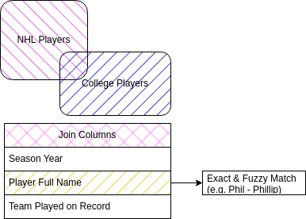

# Process NHL Player College 

Data cleaning process largely follows

* NHL player-level statistics from processed table using API using this repository's code
* NHL-college player records are from [College Hockey Inc.](https://collegehockeyinc.com/2021-22-alums-nhl.php). Rotate out the URL years to get historical records.

Not all college players are accounted for, who maybe reserve players or data not able to be matched. At the time of the initial analysis 1/26/2024, the match rate is about $\frac{2,119}{3,438}\approx 61.6\%$

## Evaluating College Tenure and Production Changes
Overall, I observe that the debut/rookie season, more game time and productions are observed for those with shorter college tenure, mostly driven by highly touted/drafted player leaving college earlier in the career. 

Evaluating the non-rookie seasons (after experiences), the game time and production is consistent across players with different college tenure. This means that the production of players sorted and filtered out during their NHL debut and subsequent seasons. This also implies that leaving college tenure early is not an indiciation of better production in NHL longer-run.

## Production by Draft Order
Higher draft pick players (1st round player went throuch college) are more likely to produce goals then their peers. However, as their career matures, the difference goes away. Again emphasizing that the player roaster selection is filtered and less depended on college tenure and drafts pick of the college players.