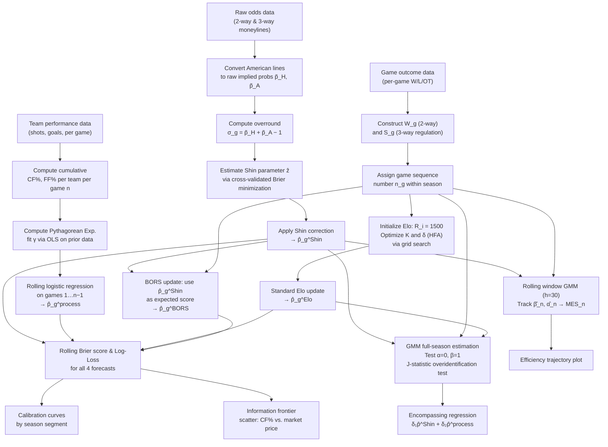

# NHL Betting Market Efficiency: Elo Ratings, Shin Probability Correction, and Process-Based Forecasting

> *Does the NHL betting market incorporate publicly available information efficiently? Does it improve as the season progresses? Can shot-quality metrics — information freely available to any bettor — outperform market prices?*

---

## Table of Contents

1. [Motivation & Research Questions](#1-motivation--research-questions)
2. [Theoretical Framework](#2-theoretical-framework)
3. [Data](#3-data)
4. [Methodology](#4-methodology)
   - 4.1 [Implied Probability Extraction & Shin Correction](#41-implied-probability-extraction--shin-correction)
   - 4.2 [Elo Rating System](#42-elo-rating-system)
   - 4.3 [GMM Estimation of Market Efficiency](#43-gmm-estimation-of-market-efficiency)
   - 4.4 [Process-Based Forecasting Metrics](#44-process-based-forecasting-metrics)
5. [Analytical Workflow](#5-analytical-workflow)
6. [Results & Visualizations](#6-results--visualizations)
7. [Statistical Testing](#7-statistical-testing)
8. [Limitations & Assumptions](#8-limitations--assumptions)
9. [References](#9-references)

---

## 1. Motivation & Research Questions

The efficient market hypothesis (EMH), transplanted from financial economics into sports betting markets, posits that bookmaker odds aggregate all publicly available information about game outcomes. Under this hypothesis, no systematic profit opportunity should exist from publicly observable team statistics — the market price already reflects them. Yet sports betting markets, and hockey markets in particular, present a structural challenge to this view: outcomes in the NHL are characterized by exceptionally high variance, a short regular season relative to the number of teams, and a large share of results decided by goaltending performance that regresses heavily from year to year. Whether the market prices these features correctly, and whether it updates appropriately as new information accumulates within a season, is an open empirical question.

This analysis examines three related but distinct claims:

**RQ1 — Static Efficiency:** Do Shin-corrected bookmaker-implied probabilities constitute unbiased, well-calibrated forecasts of NHL game outcomes across the full season?

**RQ2 — Dynamic Efficiency:** Does the accuracy of market forecasts improve monotonically as more within-season game data accumulates — that is, does the market *learn* as the season progresses?

**RQ3 — Informational Content of Process Metrics:** Do publicly available shot-quality metrics (Corsi, Fenwick, Pythagorean Expectation), which capture underlying team performance more stably than wins and losses, contain predictive information about game outcomes that the market has *not* incorporated into its prices?

A failure on RQ1 alone would suggest the market is structurally mispriced. A failure on RQ2 would imply the market is slow to update on new evidence. A failure on RQ3 — particularly if process metrics *outperform* market lines as the season matures — would constitute the strongest form of inefficiency finding: freely available, widely discussed statistics providing incremental predictive value beyond the market price.

---

## 2. Theoretical Framework

### 2.1 What Does Market Efficiency Mean in Betting?

In financial markets, weak-form efficiency requires that prices reflect all historical price information. The betting market analogue requires that odds reflect all publicly available information about the contestants. Formally, a market is efficient with respect to information set $\mathcal{I}_t$ if:

$$E[W_g \mid \mathcal{I}_t] = \hat{p}_g$$

where $W_g$ is the binary game outcome and $\hat{p}_g$ is the bookmaker's implied probability after removing the overround. Any systematic deviation from this equality — whether directional bias ($E[W_g] \neq \hat{p}_g$) or miscalibration (the relationship is nonlinear or heteroskedastic) — constitutes a form of inefficiency.

The information set $\mathcal{I}_t$ at game $g$ played at point $t$ in the season includes: prior season results, roster composition, recent form, injury news, travel schedules, and — crucially — all in-season game outcomes and shot data accumulated to date. The question of dynamic efficiency (RQ2) asks whether $\hat{p}_g$ updates appropriately as $\mathcal{I}_t$ expands over the course of the season.

### 2.2 The Overround Problem and Why Normalization is Insufficient

Bookmakers embed a margin (the *overround* or *vig*) into their prices such that implied probabilities sum to more than one:

$$\tilde{p}_H + \tilde{p}_A = 1 + \sigma, \quad \sigma > 0$$

A naive approach normalizes by dividing each raw implied probability by their sum, which assumes the margin is proportionally distributed across all outcomes. This assumption is theoretically unjustified. There is strong empirical evidence that bookmakers distribute their margin *unevenly* — heavier on underdogs — because of the specific profit motive created by the presence of privately informed bettors in the market.

The Shin (1992, 1993) model formalizes this intuition. It posits that a fraction $z$ of bettors possess insider information and will always bet on the correct outcome. To break even in expectation against this insider threat, the bookmaker must shade prices on *all* outcomes, but the shading is *larger* on outcomes with higher true probability. This produces a systematic, non-proportional distribution of the overround that biased normalization cannot correct.

### 2.3 Equilibrium Intuition: The Bookmaker's Problem

The following diagram illustrates the informational equilibrium the bookmaker operates in:

```
 ┌─────────────────────────────────────────────────────────────────┐
 │                   BOOKMAKER'S PRICING PROBLEM                   │
 │                                                                 │
 │   True probability of home win:  π_H  (unobservable)           │
 │                                                                 │
 │   Bettor population:                                            │
 │   ┌─────────────────────┐    ┌─────────────────────────────┐   │
 │   │  Noise bettors      │    │  Informed bettors           │   │
 │   │  fraction: (1 - z)  │    │  fraction: z                │   │
 │   │  bet on any side    │    │  always bet correct side    │   │
 │   └─────────────────────┘    └─────────────────────────────┘   │
 │                    │                        │                   │
 │                    └──────────┬─────────────┘                   │
 │                               ▼                                 │
 │           Bookmaker sets posted odds  p̃_H, p̃_A                 │
 │           such that expected profit ≥ 0 against both           │
 │                                                                 │
 │   Equilibrium condition:                                        │
 │   p̃_H = [z√π_H + (1-z)π_H] / Σ_k[z√π_k + (1-z)π_k]          │
 │                                                                 │
 │   Consequence: overround σ is allocated MORE heavily           │
 │   onto high-probability outcomes (favorites)                    │
 │                                                                 │
 │   ──────────────────────────────────────────────────           │
 │   Recovery goal: invert the equilibrium condition              │
 │   to recover π_H from the observed p̃_H  →  Shin (1992)        │
 └─────────────────────────────────────────────────────────────────┘
```

The recovery of $\pi_H$ from $\tilde{p}_H$ is the Shin correction. Note that $z$ is itself an estimable parameter — it captures the degree of insider trading in the market. A higher $z$ implies a market where informed bettors play a larger role in price formation, and where naive normalization produces larger biases.

### 2.4 Elo Ratings and the Latent Skill State

Elo-type rating systems model team quality as a latent state $R_i^{(t)}$ that evolves over time. The key identification assumption is that game outcomes are conditionally independent draws from a Bernoulli distribution whose probability is determined by the difference in latent ratings. This is a strong assumption — it ignores roster changes, injuries, travel, and situational effects — but it produces a parsimonious, well-identified estimator of relative team quality that can be compared directly against market prices.

The Betting Odds Rating System (BORS), introduced by Štrumbelj & Vračar (2012), extends standard Elo by using the bookmaker's implied probability as the expected score in the update equation, rather than the Elo-derived expected score. Under this modification, the Elo rating absorbs only the *residual* information in game outcomes after conditioning on what the market already knew. If BORS ratings and standard Elo ratings diverge systematically over a season, it implies the market is not efficiently encoding the same latent quality signal that game outcomes reveal.

### 2.5 Why Process Metrics Might Outperform Market Prices

Wins and losses in hockey contain substantial noise. A team can win a game 2–1 despite being outshot 40–20, either because of exceptional goaltending or because of fortunate shot placement. Over a short run of games, winning percentage is a poor signal of underlying team quality. Shot-attempt metrics (Corsi, Fenwick) and goal-based expected value metrics (Pythagorean Expectation) are designed to strip away this noise by focusing on the *process* — the volume and quality of shot attempts — rather than the outcome.

The theoretical prediction is clear: early in the season, when sample sizes are small, these metrics should be noisy predictors. As the season progresses, the law of large numbers reduces their variance, and they should converge toward stable estimates of true team quality. If the market is efficient, it should be *anticipating* this convergence — incorporating process information from the first available games. If, instead, the market continues to price teams based on won-loss records, public narrative, or prior-season reputation, then process metrics will eventually contain incremental predictive information that the market has left unpriced.

---

## 3. Data

The datasets for this analysis are natively sourced and updated by the backend automated pipeline via Databricks Workflows. The raw CSV volumes are combined into managed Delta Tables under the `nhl-databricks.data` schema.

### 3.1 Game Outcome Data

- **Source**: Databricks Delta Table `nhl-databricks.data.box`.
- **Coverage**: 2024 and 2025 seasons.
- **Variables**: `gameid` (primary key integer), `date`, `tricode_for` (home team), `tricode_against` (away team), `metric_score_for` (home goals), `metric_score_against` (away goals), and `period_ending`.
- **Notes on OT/Shootout treatment**: The `period_ending` column dictates the result context. For 3-way regulation analysis, games ending in "OT" or "SO" are functionally equivalent to a regulation draw. For 2-way market analysis, the eventual winner (inferred by `tricode_winteam` or goal differential) is marked 1 regardless of period depth.

### 3.2 Betting Odds Data

- **Source**: Databricks Delta Table `nhl-databricks.data.odds`.
- **Coverage**: 2024 and 2025 seasons. We will specifically exclude Canadian market lines by applying the filter `country != 'CA'`. This leaves the US and Legacy/Merged odds as our core unified forecasting price.
- **Pull methodology and timing**: Lines are captured continuously leading up to games. We will select the row with the maximum `lastUpdatedUTC` that is strictly less than `startTimeUTC` to represent the closing line.
- **2-way vs. 3-way market availability**: Extracted from the `odds_description` column. 2-way odds are identified by identifiers like "Moneyline", while 3-way markets use descriptions like "60 Minute Prediction" or "Regulation Time". Raw prices are stored in `home_odds_value` and `away_odds_value`.
- **Known gaps or irregular pull times**: Any games entirely missing odds entries (or with severe `lastUpdatedUTC` delays) will be dropped from the primary efficiency test to avoid stale-line biases.

### 3.3 Team Performance & Shot Data

- **Source**: `nhl-databricks.data.playbyplay` and `nhl-databricks.data.box_team`.
- **Variables**: Detailed shot events (blocked, missed, saved, goal) from event logs, as well as team goals against (`GA`), goals for (`GF`), and `shots`. 
- **Strength-state filtering (5v5, score-adjusted)**: Game-level metrics will be filtered to isolate 5-on-5 play where possible.
- **Game-level vs. cumulative construction**: 
  - **Task (To Be Created)**: A longitudinal panel data structure must be explicitly generated. For each team $i$ over the course of season $s$, we need to aggregate the game-level underlying metrics into a cumulative rolling prior.
  - **Logic**: For a game scheduled on day $t$, sum the $CF$ and $CA$ (as well as Pythagorean goals $GF$ and $GA$) across all prior games $1$ through $n-1$. This strictly prevents look-ahead bias and forms the basis for the $\hat{p}_g^{\text{process}}$ variable.

### 3.4 Data Merging & Game Index Construction

- **Match key between odds and outcome data**: The primary key for joining across all tables is the uniform integer `gameid`. For team-specific context (like matching home team stats to home team odds), `tricode_for` and `tricode_against` will be equated to `homeTeam.abbrev` and `awayTeam.abbrev`.
- **Game sequence number $n_g$ assignment**: 
  - **Task (To Be Created)**: We must dynamically calculate a monotonic sequence integer $n_g \in [1, 82]$ representing the chronological game count for each team in a given season, sorted by `date` / `startTimeUTC`. This sequence dimension dictates the rolling subsets for dynamic GMM estimation.
- **Season coverage**: 2024–2025 seasons.

---

## 4. Methodology

### 4.1 Implied Probability Extraction & Shin Correction

#### Raw Implied Probability

American moneyline odds $M$ for a given side are converted to raw implied probability $\tilde{p}$ as follows. For a positive line (underdog):

$$\tilde{p} = \frac{100}{100 + M}$$

For a negative line (favorite):

$$\tilde{p} = \frac{|M|}{|M| + 100}$$

The overround for game $g$ is:

$$\sigma_g = \tilde{p}_H + \tilde{p}_A - 1$$

#### Why Naive Normalization Fails

The proportional normalization $p_H^{\text{norm}} = \tilde{p}_H / (\tilde{p}_H + \tilde{p}_A)$ implicitly assumes $\sigma_g$ is split equally between the two sides. This assumption holds only if the bookmaker has no view on which side is more likely to attract informed bettors — an assumption that fails precisely in the asymmetric case (favorite vs. underdog) where the distinction matters most.

#### The Shin Correction

Under the Shin (1992) equilibrium, the posted odds satisfy:

$$\tilde{p}_k = \frac{z\sqrt{\pi_k} + (1-z)\pi_k}{\displaystyle\sum_{j \in \{H,A\}} \left[ z\sqrt{\pi_j} + (1-z)\pi_j \right]}$$

where $\pi_k$ is the true win probability for side $k$, and $z \in (0,1)$ is the fraction of informed bettors. The parameter $z$ is estimated across all games in the dataset by minimizing the Brier score on held-out observations, or equivalently via GMM as described in Section 4.3.

For a two-outcome market, the correction inverts this mapping. Given estimated $\hat{z}$ and normalized raw probabilities $p_H^{\text{norm}}$, the Shin-corrected probability $\hat{p}_H^{\text{Shin}}$ solves the quadratic:

$$a \cdot \hat{p}^2 + b \cdot \hat{p} + c = 0$$

where $a = 1 - \hat{z}$, $b = \hat{z}\sqrt{1 - p_H^{\text{norm}}} - (1-\hat{z})(1-p_H^{\text{norm}})$, and $c$ is a function of $p_H^{\text{norm}}$ and $\hat{z}$. The physically meaningful root (bounded in $[0,1]$) is taken as $\hat{p}_H^{\text{Shin}}$.

The 3-way market (regulation outcome — home win, draw, away win) requires an extension of the Shin correction to three outcomes, following Štrumbelj (2014). This is the preferred outcome variable when analyzing Corsi and Fenwick, which are most theoretically motivated by regulation 5v5 play.

---

### 4.2 Elo Rating System

#### Standard Elo

Every team $i$ carries a latent rating $R_i^{(t)}$ initialized at 1500 at the start of the season (with optional partial carryover from the prior season, regressing toward the mean at rate $\rho$, e.g. $R_i^{(0)} = 1500 + \rho(R_i^{\text{prev}} - 1500)$ with $\rho \approx 0.75$). The expected score for the home team in game $g$ between teams $i$ and $j$ is:

$$E_{ij}^{(t)} = \frac{1}{1 + 10^{-(R_i^{(t)} - R_j^{(t)} + \delta)/400}}$$

where $\delta$ is the home-ice advantage offset in Elo points, treated as a free parameter and calibrated empirically by minimizing out-of-sample Brier score over a grid search.

After the game, ratings update as:

$$R_i^{(t+1)} = R_i^{(t)} + K\left(S_{ij} - E_{ij}^{(t)}\right)$$
$$R_j^{(t+1)} = R_j^{(t)} + K\left(S_{ji} - E_{ji}^{(t)}\right)$$

where $S_{ij} \in \{1, 0.5, 0\}$ is the actual outcome (win, overtime/shootout loss, regulation loss) and $K$ is the sensitivity parameter. The K-factor is estimated by cross-validated grid search over $K \in [4, 32]$. Because hockey outcomes contain more randomness than most sports, optimal $K$ values tend to be lower than in football or basketball — typically in the range of $K \approx 6$–$16$.

#### BORS — Betting Odds Rating System

The BORS modification (Štrumbelj & Vračar 2012) replaces the Elo-derived expected score with the Shin-corrected market probability:

$$R_i^{(t+1)} = R_i^{(t)} + K\left(S_{ij} - \hat{p}_{g}^{\text{Shin}}\right)$$

This formulation decomposes the information content of game results: ratings move *only* when outcomes diverge from what the market predicted. A team that wins a game the market assigned 80% probability gains very little Elo — the result was anticipated. A team that wins a game the market assigned 30% probability gains substantially. The BORS rating can be interpreted as tracking *latent quality net of market expectation* — a measure of systematic market error. If BORS ratings deviate persistently and predictably from standard Elo, this constitutes direct evidence that the market is failing to price some dimension of team quality.

---

### 4.3 GMM Estimation of Market Efficiency

#### The Core Efficiency Condition

Market efficiency in the probabilistic sense requires that the Shin-corrected probability is an unbiased predictor of outcomes. A natural test regresses the binary outcome on the market forecast:

$$W_g = \alpha + \beta \hat{p}_g^{\text{Shin}} + \varepsilon_g$$

Under the null of efficiency: $H_0: \alpha = 0,\ \beta = 1$. A finding of $\beta < 1$ indicates the market is overconfident — it assigns too much probability to favorites, so when favorites win, the outcome is less informative than the odds implied. A finding of $\alpha > 0$ indicates a systematic directional bias — the market chronically underestimates some teams or game types.

Ordinary least squares estimation of this regression is consistent but potentially inefficient given heteroskedasticity (outcome variance depends on $\hat{p}_g$). Generalized Method of Moments (GMM) estimation exploits additional moment conditions to improve efficiency and provides a natural framework for testing overidentifying restrictions.

#### Moment Conditions

Define the vector of instruments $\mathbf{z}_g$ and the parameter vector $\boldsymbol{\theta} = (\alpha, \beta)'$. The GMM estimator is defined by the sample moment conditions:

$$\mathbf{m}(\boldsymbol{\theta}) = \frac{1}{G}\sum_{g=1}^{G} \mathbf{z}_g \left(W_g - \alpha - \beta\hat{p}_g^{\text{Shin}}\right) = \mathbf{0}$$

A natural instrument set is:

$$\mathbf{z}_g = \left[1,\ \hat{p}_g^{\text{Shin}},\ \left(\hat{p}_g^{\text{Shin}}\right)^2,\ E_{ij,g}^{\text{Elo}},\ n_g\right]$$

where $n_g$ is the game number within the season. The inclusion of $\left(\hat{p}_g^{\text{Shin}}\right)^2$ allows detection of nonlinear miscalibration (overconfidence at the extremes of the probability scale, underconfidence near 0.5). The Elo expected score serves as an additional instrument representing independent information about team quality.

The GMM estimator minimizes the quadratic form:

$$\hat{\boldsymbol{\theta}}_{\text{GMM}} = \arg\min_{\boldsymbol{\theta}}\ \mathbf{m}(\boldsymbol{\theta})' \hat{W}^{-1} \mathbf{m}(\boldsymbol{\theta})$$

where $\hat{W}$ is the consistent estimator of the variance-covariance matrix of the moments, estimated in a first step using the identity weighting matrix. Heteroskedasticity-robust (sandwich) standard errors are used throughout.

When the system is overidentified (more instruments than parameters), the **J-statistic**:

$$J = G \cdot \mathbf{m}(\hat{\boldsymbol{\theta}})' \hat{W}^{-1} \mathbf{m}(\hat{\boldsymbol{\theta}}) \overset{a}{\sim} \chi^2(q)$$

where $q$ is the number of overidentifying restrictions, tests whether the excluded instruments are jointly uncorrelated with the residual after conditioning on the market price. Rejection of $J = 0$ implies the instruments contain information about outcomes that the market has not incorporated — a direct formal test of the efficiency hypothesis.

#### Time-Varying Efficiency: Rolling GMM

The full-season GMM estimates $\hat{\alpha}$ and $\hat{\beta}$ characterize *average* efficiency across the season. To answer whether efficiency changes as the season progresses (RQ2), the GMM is re-estimated on a rolling window of the most recent $h$ games (window size $h = 30$ selected to balance precision and responsiveness):

$$\hat{\beta}_{n} = \text{GMM estimate of } \beta \text{ using games } [n-h, n]$$

Plotting $\hat{\beta}_n$ with 95% confidence intervals over game number $n$ traces the *efficiency trajectory* of the market. Convergence toward $\hat{\beta}_n \approx 1$ as $n$ increases would constitute evidence of market learning. Persistent deviations suggest structural rather than informational sources of mispricing.

A composite **Market Efficiency Score** is defined as:

$$\text{MES}_n = 1 - \left|\hat{\beta}_n - 1\right| - \left|\hat{\alpha}_n\right|$$

with $\text{MES} = 1$ corresponding to perfect efficiency and lower values indicating greater departure.

---

### 4.4 Process-Based Forecasting Metrics

#### Corsi and Fenwick

For team $i$ through game $n$ of the season, define cumulative shot-attempt counts at 5-on-5 play:

- $CF_i^{(n)}$: Corsi For — all shot attempts directed toward the opponent net (shots on goal + missed shots + blocked shots)
- $CA_i^{(n)}$: Corsi Against — all shot attempts directed toward team $i$'s net
- $FF_i^{(n)}$, $FA_i^{(n)}$: Fenwick (unblocked shots only) equivalents

The cumulative rates are:

$$\text{CF\%}_i^{(n)} = \frac{CF_i^{(n)}}{CF_i^{(n)} + CA_i^{(n)}}$$

$$\text{FF\%}_i^{(n)} = \frac{FF_i^{(n)}}{FF_i^{(n)} + FA_i^{(n)}}$$

Where data permit, these are computed at *score-adjusted* 5-on-5 to remove the well-documented bias whereby trailing teams push offensive zone play and inflate their shot attempts. Score-adjustment uses game-state-specific league-average rates to reweight each period's contribution.

The theoretical motivation for these metrics is that, while any single hockey game is heavily influenced by goaltending variance and shooting percentage fluctuations, shot attempt rates stabilize to true underlying rates quickly — typically within 20–30 games. A team that dominates shot attempts is generating more dangerous play in expectation, and its winning percentage should eventually converge toward its shot-attempt differential.

#### Pythagorean Expectation

The Pythagorean Expectation formula, adapted from James (1980) for hockey, estimates a team's expected win rate from its goal differential:

$$\text{Pyth}_i^{(n)} = \frac{GF_i^{(n)^\gamma}}{GF_i^{(n)^\gamma} + GA_i^{(n)^\gamma}}$$

The exponent $\gamma$ is estimated empirically by ordinary least squares, regressing actual point percentage on the ratio $GF^\gamma / (GF^\gamma + GA^\gamma)$ and solving for the $\gamma$ that minimizes residual variance. For hockey, published estimates cluster around $\gamma \approx 2.0$–$2.37$; this analysis fits $\gamma$ directly from the available season data.

The Pythagorean metric captures whether a team is winning games *in proportion to its goal-scoring and prevention*, or whether it is outperforming (or underperforming) its expected win rate — a signal of either sustainable quality or variance-driven luck that should not persist.

#### Process Forecast Construction

To generate a win probability for game $g$ from process metrics, a logistic regression is estimated on all games prior to game $g$:

$$\log\frac{P(W_g = 1)}{1 - P(W_g = 1)} = \gamma_0 + \gamma_1 \Delta\text{CF\%}^{(n-1)} + \gamma_2 \Delta\text{FF\%}^{(n-1)} + \gamma_3 \Delta\text{Pyth}^{(n-1)}$$

where $\Delta$ denotes the difference between the home and away team's metric value computed through game $n-1$. This yields $\hat{p}_g^{\text{process}}$ — the process-metric-implied probability — estimated out-of-sample and re-fit at every game as more data accumulates. This rolling re-estimation is crucial: it mimics the experience of a bettor using only information available at time $g$, and it ensures the forecast's improving accuracy over the season reflects genuine information accumulation, not in-sample fitting.

#### Scoring Rules and Forecast Comparison

Four competing forecasts are compared across the season:

| Forecast | Notation | Source |
|---|---|---|
| Shin-corrected market | $\hat{p}_g^{\text{Shin}}$ | Bookmaker moneyline |
| Standard Elo | $\hat{p}_g^{\text{Elo}}$ | Game outcomes only |
| BORS Elo | $\hat{p}_g^{\text{BORS}}$ | Game outcomes + market |
| Process metrics | $\hat{p}_g^{\text{process}}$ | Corsi / Fenwick / Pythagorean |

Each forecast is evaluated using two proper scoring rules. The **Brier Score**:

$$BS = \frac{1}{G}\sum_{g=1}^{G}\left(W_g - \hat{p}_g\right)^2$$

and the **Log-Loss**:

$$LL = -\frac{1}{G}\sum_{g=1}^{G}\left[W_g \log\hat{p}_g + (1 - W_g)\log(1-\hat{p}_g)\right]$$

Both are *proper* scoring rules — a forecaster minimizes expected loss only by reporting true beliefs — making them appropriate for comparing probabilistic forecasts. Lower values indicate better performance. Both metrics are computed on a rolling 30-game window to produce time series of forecast quality.

---

## 5. Analytical Workflow

The complete estimation pipeline proceeds as follows:



---

## 6. Results & Visualizations

### Visualization 1: Market Efficiency Trajectory (Rolling GMM)

**Description:** The rolling GMM estimates $\hat{\beta}_n$ and $\hat{\alpha}_n$ are plotted against game number $n$ (x-axis), with 95% confidence bands. A horizontal reference line at $\hat{\beta}_n = 1$ denotes the efficiency benchmark.

**Interpretation:** Under an efficient market, $\hat{\beta}_n$ should remain statistically indistinguishable from 1 throughout the season. Early-season deviations below 1 are expected simply due to small sample variance, but systematic and persistent deviations reveal structural features of market mispricing. A trajectory that starts below 1 and converges toward it by mid-season would be consistent with a market that initially relies on prior-season reputation and gradually updates toward within-season performance. Persistence deep into the season — particularly when sample sizes are large enough to rule out finite-sample noise — constitutes the core evidence of inefficiency. The $\hat{\alpha}_n$ trajectory reveals whether the bias is directional: a consistently positive intercept, for example, would indicate the market chronically underestimates home teams or systematically overprices certain market segments.

---

### Visualization 2: Rolling Brier Score — Four-Model Comparison

**Description:** A four-line time series of rolling Brier score (or log-loss) over game number $n$, one line per forecast model ($\hat{p}^{\text{Shin}}$, $\hat{p}^{\text{Elo}}$, $\hat{p}^{\text{BORS}}$, $\hat{p}^{\text{process}}$), with a horizontal reference line at the naive 0.5 prior. Window size $h = 30$ games.

**Interpretation:** All models should perform poorly early in the season, when cumulative game counts are low and estimates are noisy. The diagnostic question is about *convergence rates* and *ordinal rankings* as $n$ grows. If $\hat{p}^{\text{process}}$ converges toward $\hat{p}^{\text{Shin}}$ from above (worse to comparable) or surpasses it (comparable to better) by mid-season, this directly answers RQ3: the market is failing to price information that an investor with access only to public shot data could have exploited. The relationship between $\hat{p}^{\text{Elo}}$ and $\hat{p}^{\text{BORS}}$ is also informative — if BORS consistently outperforms standard Elo, it implies the market is providing useful conditioning information beyond raw outcomes; if standard Elo matches or beats BORS, the market's incremental information value beyond game results is negligible.

---

### Visualization 3: Calibration Curves by Season Segment

**Description:** Three panels — Early (games 1–25), Mid (games 26–55), Late (games 56–82) — each showing a calibration (reliability) diagram. Games are binned into deciles by $\hat{p}_g$ for each model. Each decile's mean predicted probability is plotted against the mean realized win rate. The 45-degree diagonal represents perfect calibration.

**Interpretation:** Well-calibrated forecasts produce points lying along the diagonal across all probability ranges. Systematic bow-shaped deviation below the diagonal at high probabilities (and above it at low probabilities) is the signature of *overconfidence* — the model treats close games as decisive. The Shin correction should visibly improve calibration over the raw normalized odds, particularly at the extremes of the probability distribution. The key analytical question is whether calibration improves from the early-season to the late-season panel for the process model while remaining stable (or worsening) for the market model. If the market's calibration is flat across panels, it suggests market prices are anchored to information that does not update with within-season evidence. If the process model's calibration systematically improves, it confirms that shot-quality metrics become increasingly reliable predictors as sample sizes accumulate.

---

### Visualization 4: The Information Efficiency Frontier

**Description:** A scatter plot where each point represents a team-season. The x-axis shows the team's final-season CF% (or Pythagorean Expectation), and the y-axis shows the team's average Shin-corrected market-implied win probability across all games in the season. Points are colored by actual win rate (point percentage). A 45-degree reference line is included. A supplementary panel shows the residual $\hat{p}^{\text{Shin}} - \hat{p}^{\text{process}}$ plotted over game number for each team.

**Interpretation:** Teams lying above the diagonal are *overpriced by the market* relative to what their shot quality would imply — the bookmaker believes them to be better than their underlying process suggests. These are typically high-reputation franchises, or teams whose goaltending inflated early-season winning percentage beyond what shot suppression would predict. Teams below the diagonal are underpriced relative to their process quality. If these systematic discrepancies are large and *persistent* — if the residual panel shows no convergence to zero as the season progresses — this is the strongest possible finding: freely available, publicly discussed process metrics contain information about game probabilities that the market is simply ignoring. The scatter plot also reveals whether the relationship between process metrics and market prices is nonlinear, which would indicate more complex pricing biases than a simple favorite-longshot effect.

---

## 7. Statistical Testing

Beyond the visualizations, a formal results table reports the following tests:

**Mincer-Zarnowitz Forecast Rationality Test:** Regress $W_g$ on a constant and $\hat{p}_g$ for each model separately, and test the joint null $H_0: \alpha = 0, \beta = 1$ via a Wald test. Rejection for the market model ($\hat{p}^{\text{Shin}}$) but not for the process model ($\hat{p}^{\text{process}}$) at mid- or late-season would be a striking reversal result.

**Diebold-Mariano Test (pairwise):** For each pair of models, the DM test evaluates whether the difference in loss functions (Brier score or log-loss) is statistically significantly different from zero. This converts visual differences in the Brier score comparison chart into formal inferential statements. Of particular interest is the DM test between $\hat{p}^{\text{Shin}}$ and $\hat{p}^{\text{process}}$ in the late-season window.

**J-statistic from Overidentified GMM:** Tests whether the instruments excluded from the just-identified system are jointly orthogonal to the market forecast residual. Rejection is a formal statement that those instruments — Elo ratings, season game count, quadratic probability terms — contain information about outcomes that the market has not priced.

**Forecast Encompassing Regression:** The most direct test of whether process metrics contain *incremental* information beyond the market. The full specification is:

$$W_g = \delta_0 + \delta_1\hat{p}_g^{\text{Shin}} + \delta_2\hat{p}_g^{\text{process}} + \delta_3\hat{p}_g^{\text{Elo}} + \varepsilon_g$$

A statistically significant positive $\hat{\delta}_2$ after conditioning on $\hat{p}_g^{\text{Shin}}$ is the headline efficiency-failure result: Corsi/Fenwick/Pythagorean data adds predictive information *beyond* what the market has already priced in. Significance of $\hat{\delta}_3$ (Elo) after conditioning on the market would indicate that the market systematically understates or overstates the reversion speed of team quality estimates.

---

## 8. Limitations & Assumptions

**Odds data timing:** All odds are recorded approximately four hours prior to game time. Late-breaking information (injury announcements, lineup changes, goaltender confirmations) that arrives after the pull time will appear in the outcome but not in the odds. This introduces a systematic signal that cannot be captured by the model — the assumption is that such late-breaking events are uncorrelated with the direction of our main results and do not bias the efficiency tests, though they will add noise to all forecasts.

**Overround stability:** The model assumes the margin $\sigma_g$ does not change materially between the pull time and game time. In practice, line movement continues until puck drop. The recorded line is treated as representative of the informational content of the market at a consistent point in the day, conditional on the implicit assumption that directional views do not reverse in the final hours before games.

**Time zone and game scheduling effects:** Games played at different local times may attract different bettor populations and line movement dynamics. No adjustment is made for this heterogeneity. If systematic differences in market efficiency exist by geographic region or day of week, the rolling estimates will average across them.

**Score adjustment for process metrics:** If game-state score-adjusted Corsi is unavailable, the unadjusted CF% will be biased toward teams that tend to play from behind (which inflates their shot attempts) or from ahead (which suppresses them). The direction of this bias favors winning teams — the market likely already prices winning records — so unadjusted metrics may understate the incremental content of shot data in the encompassing regression.

**Cross-season stationarity:** The 2024 and 2025 season data are pooled under the assumption that the relationship between process metrics, market prices, and outcomes is stationary across seasons. Roster turnover, rule changes, and officiating trend shifts can all violate this assumption. Season fixed effects or separate estimation by season serves as a robustness check.

**Sample size constraints:** The NHL regular season is 82 games per team, yielding approximately 1,312 game observations total. The rolling GMM uses windows of 30 games. These sample sizes are sufficient for the main tests, but power may be limited for detecting small-magnitude inefficiencies in the encompassing regression, particularly early in the season.

---

## 9. References

- Shin, H.S. (1992). Prices of State Contingent Claims with Insider Traders, and the Favourite-Longshot Bias. *The Economic Journal*, 102(411), 426–435.
- Shin, H.S. (1993). Measuring the Incidence of Insider Trading in a Market for State-Contingent Claims. *The Economic Journal*, 103(420), 1141–1153.
- Štrumbelj, E. & Vračar, P. (2012). Simulating a Basketball Match with a Homogeneous Markov Model and Forecasting the Outcome. *International Journal of Forecasting*, 28(2), 532–542.
- Štrumbelj, E. (2014). On Determining Probability Forecasts from Betting Odds. *International Journal of Forecasting*, 30(4), 934–943.
- Hvattum, L.M. & Arntzen, H. (2010). Using ELO Ratings for Match Result Prediction in Association Football. *International Journal of Forecasting*, 26(3), 460–470.
- Spann, M. & Skiera, B. (2009). Sports Forecasting: A Comparison of the Forecast Accuracy of Prediction Markets, Betting Odds and Tipsters. *Journal of Forecasting*, 28(1), 55–72.
- James, B. (1980). *1980 Baseball Abstract*. Self-published.
- Diebold, F.X. & Mariano, R.S. (1995). Comparing Predictive Accuracy. *Journal of Business & Economic Statistics*, 13(3), 253–263.
- Mincer, J. & Zarnowitz, V. (1969). The Evaluation of Economic Forecasts. In *Economic Forecasts and Expectations*. NBER.
