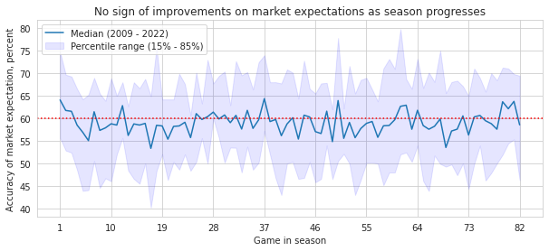

[back to the main page](../../index.md)

# Better than coin flips? Money line and market expectation in NHL

When creating a framework or a model explaining team performances, we narrow down the scope of the evaluation criteria (e.g. amount of information) to derive more interpretable trends and phenomena. Doing so limits the available information that otherwise can be reflected and helps make better prediction (e.g. you could have been right 61% of the games, instead of 60%). 

Market expecation theoretically reflects all available information. Applying a concept in finance called [Efficient Market Hypothesis](https://en.wikipedia.org/wiki/Efficient-market_hypothesis), we can assume that the overall prediction tends to be more accurante on average than any single agent or model.

The analysis below evaluates the predictive power of the market expectation. Using the publicly available sports betting data (specifically on money line), I answer following questions,
* How good is the market predicting the outcome of each game? 
* Is there a disparity (heterogeneous) in predicting outcome, specific teams or win/loss?
* Is the market better and more confident in predicting wins than losses?
* As the market accumulates more information about each team as each season progress (i.e. as each season progress and more games are played), does the market make better prediction?

This analysis serves as a first part of NHL team performance analysis using NHL data.


```python
import pandas as pd
pd.options.mode.chained_assignment = None
import numpy as np
from datetime import datetime, timedelta

from matplotlib import pyplot as plt
import seaborn as sns
```


```python
def func_df(df, year_start, year_end):
    # function to process the data
    # Adjust column names
    #   multi-row data pull for python assings the first column.
    #     More sophisticated method is to start the data pull row at 2nd row
    df.rename(columns = {'PuckLine' : 'PuckLine_spread', 
              'Unnamed: 11' : 'PuckLine_MoneyLine',
              'OpenOU' : 'OpenOU_spread', 
              'Unnamed: 13' : 'OpenOU_MoneyLine',
              'CloseOU' : 'CloseOU_spread',
              'Unnamed: 15' : 'CloseOU_MoneyLine', 
              "Close OU": "CloseOU", 
              "Open OU" : "OpenOU", 
              "Puck Line":"PuckLine",
              "Clos":"Close"
              }, inplace = True)

    # For now, use the following column:
    df = df.loc[:,['Date', 'Rot', 'VH', 'Team', '1st','2nd', '3rd', 'Final', 'Open', 'Close']]
    # Some adhoc data cleaning:
    # For 2021 season data, final score is marked 'F' and at 3rd period score
    if 'F' in df.Final.unique():
        df.loc[(df.Final == 'F'), 'Final'] = df[(df.Final == 'F')]['3rd']
        # Need to convert the columns to integer
        df['Final'] = df.Final.astype(int)

    # Process date time --------------------------------------------------------
    # create year column, based on the month-date integer column
    # Season starts around October, which the length of each element is 4,
    #   The new calendar year, the length becomes 3
    df['yr'] = str(year_end)
    df.loc[([len(str(iter)) == 4 for iter in df.Date]), 'yr'] = str(year_start)

    df['yr_season'] = str(year_end)

    # start with dummy place
    df['gameDate'] = datetime.today(); 
    # Create date in string format similar to NHL data
    for iter, value in enumerate(df.Date):
        # pad in 4-digit month/date format to extract
        temp_ls = str(value).rjust(4, '0')
        lst_mo = temp_ls[:2]
        lst_day = temp_ls[-2:]
        # Create date format 
        iter_date = df.yr[iter] + '-' + lst_mo + '-' + lst_day
        iter_date = datetime.strptime(iter_date, '%Y-%m-%d')
        df.loc[iter, 'gameDate'] = iter_date
        # Calculate week start
        df.loc[iter, 'gameDate_wknd'] = iter_date - timedelta(days=iter_date.weekday())

    # Process team name --------------------------------------------------------
    #  Make sure all teams are included (there may be some new teams)
    #Team = list(df.Team.unique())
    Team = ['Pittsburgh', 'TampaBay', 'SeattleKraken', 'Vegas', 'NYRangers', 
            'Washington', 'Montreal', 'Toronto', 'Vancouver', 'Edmonton', 'Chicago', 
            'Colorado', 'Winnipeg', 'Anaheim', 'Ottawa', 'Buffalo', 'Florida', 
            'NYIslanders', 'Carolina', 'Dallas', 'Arizona', 'Columbus', 'Detroit', 
            'Nashville', 'LosAngeles', 'NewJersey', 'Philadelphia', 'Minnesota', 
            'Boston', 'St.Louis', 'Calgary', 'SanJose', 'Phoenix', 'Atlanta',
            'WinnipegJets', 'Tampa', 'Arizonas', 'Tampa Bay', 'NY Islanders'];
    team_tri = ['PIT', 'TBL', 'SEA', 'VGK', 'NYR',
            'WSH', 'MTL', 'TOR', 'VAN', 'EDM', 'CHI',
            'COL', 'WPG', 'ANA', 'OTT', 'BUF', 'FLA',
            'NYI', 'CAR', 'DAL', 'ARI', 'CBJ', 'DET',
            'NSH', 'LAK', 'NJD', 'PHI', 'MIN',
            'BOS', 'STL', 'CGY', 'SJS', 'ARI', 'WPG',
            'WPG', 'TBL', 'ARI', 'TBL', 'NYI'];
    df_tricode = pd.DataFrame(data = {'Team':Team, 'team_tri':team_tri})

    # Join with the data
    df = df.join(df_tricode.set_index('Team'), on = 'Team')

    # Drop useless columns
    df.drop(labels = ['Date', 'Rot', 'Team'], axis = 1, inplace = True)

    # Process game for each team records
    #assumes the game is in order (very important)
    df_home = df.loc[df.VH == 'V', :].reset_index(drop = True)
    df_home.drop(labels = ['VH'], axis = 1, inplace = True)
    df_away = df.loc[df.VH == 'H', :].reset_index(drop = True)
    df_away.drop(labels = ['VH'], axis = 1, inplace = True)

    df_fin = df_away.join(df_home, lsuffix = '_away', rsuffix = '_home')

    # Create game ticker following the rule - following the data rule that is
    #   used for the NHL data
    df_fin['gameIdx'] = '';

    # The tricode of team orders (visiting team) - (home team)
    for idx, value in enumerate(df_fin.team_tri_home):
        # away, home, date
        df_fin.loc[idx, 'gameIdx'] = df_fin.team_tri_away[idx] + '_' + \
                         df_fin.team_tri_home[idx] + '_' + \
                         str(df_fin.gameDate_home[idx].strftime("%Y-%m-%d"))

    # Compare game outcome and market prediction -------------------------------
    df_fin['win_home'] = 0.5
    df_fin['win_away'] = 0.5
    # Home team wins
    idx_rows = (df_fin.Final_home > df_fin.Final_away)
    df_fin.loc[idx_rows, 'win_home'] = 1
    df_fin.loc[idx_rows, 'win_away'] = 0

    # Away team wins
    idx_rows = (df_fin.Final_home < df_fin.Final_away)
    df_fin.loc[idx_rows, 'win_home'] = 0
    df_fin.loc[idx_rows, 'win_away'] = 1

    df_fin['win_ml_home'] = 0
    df_fin['win_ml_away'] = 0
    # Predicted home team will win (negative money line)
    #   Positive == Underdog (market expects to lose)
    idx_rows = df_fin.Close_home < df_fin.Close_away
    df_fin.loc[idx_rows, 'win_ml_home'] = 1
    df_fin.loc[idx_rows, 'win_ml_away'] = 0

    idx_rows = df_fin.Close_home > df_fin.Close_away
    df_fin.loc[idx_rows, 'win_ml_home'] = 0
    df_fin.loc[idx_rows, 'win_ml_away'] = 1

    # This way, in future, instead of boolean, more continuous measure can be
    #   accounted for

    # Boolean prediction match
    df_fin['win_pred_home'] = 0
    df_fin['win_pred_away'] = 0
    # Predicted home team will win
    idx_rows = df_fin.win_home == df_fin.win_ml_home
    df_fin.loc[idx_rows, 'win_pred_home'] = 1
    # Predicted away team will win
    idx_rows = df_fin.win_away == df_fin.win_ml_away
    df_fin.loc[idx_rows, 'win_pred_away'] = 1

    # rename game period stats
    df_fin.rename(columns = {'1st':'game_1st', '2nd':'game_2nd', 
                             '3rd':'game_3rd', 'Final':'game_final',})
    return df_fin
```

## Import data from websites
Import data from websites


```python
# Scrape data of the year available
last_yr_edge = 22 #2022
vec_yr = range(7, 22)

for iter in vec_yr:
    str_yr_start = str(iter).rjust(2, '0')
    str_yr_end = str(iter + 1).rjust(2, '0')

    str_url = 'https://www.sportsbookreviewsonline.com/scoresoddsarchives/' + \
              f'nhl/nhl%20odds%2020{str_yr_start}-{str_yr_end}.xlsx'
    # Exception of COVID outbreak year
    if str_yr_start == '20':
        str_url = 'https://www.sportsbookreviewsonline.com/scoresoddsarchives/' + \
              f'nhl/nhl%20odds%2020{str_yr_end}.xlsx'
    
    print(str_url)

    # Import data as needed 
    df = pd.read_excel(str_url)
    year_start = (int('20' + str_yr_start))
    year_end = (int('20' + str_yr_end))

    df_prop = func_df(df, year_start, year_end)
    # Join with the existing data
    if iter == 7: # the first data
        # Do not append the data
        df_fin = df_prop
    else : # append data as needed
        df_fin = pd.concat([df_fin, df_prop])
df_fin.reset_index(drop = True, inplace = True)
```

    https://www.sportsbookreviewsonline.com/scoresoddsarchives/nhl/nhl%20odds%202007-08.xlsx
    

    /usr/local/lib/python3.7/dist-packages/ipykernel_launcher.py:22: FutureWarning: elementwise comparison failed; returning scalar instead, but in the future will perform elementwise comparison
    

    https://www.sportsbookreviewsonline.com/scoresoddsarchives/nhl/nhl%20odds%202008-09.xlsx
    https://www.sportsbookreviewsonline.com/scoresoddsarchives/nhl/nhl%20odds%202009-10.xlsx
    https://www.sportsbookreviewsonline.com/scoresoddsarchives/nhl/nhl%20odds%202010-11.xlsx
    https://www.sportsbookreviewsonline.com/scoresoddsarchives/nhl/nhl%20odds%202011-12.xlsx
    https://www.sportsbookreviewsonline.com/scoresoddsarchives/nhl/nhl%20odds%202012-13.xlsx
    https://www.sportsbookreviewsonline.com/scoresoddsarchives/nhl/nhl%20odds%202013-14.xlsx
    https://www.sportsbookreviewsonline.com/scoresoddsarchives/nhl/nhl%20odds%202014-15.xlsx
    https://www.sportsbookreviewsonline.com/scoresoddsarchives/nhl/nhl%20odds%202015-16.xlsx
    https://www.sportsbookreviewsonline.com/scoresoddsarchives/nhl/nhl%20odds%202016-17.xlsx
    https://www.sportsbookreviewsonline.com/scoresoddsarchives/nhl/nhl%20odds%202017-18.xlsx
    https://www.sportsbookreviewsonline.com/scoresoddsarchives/nhl/nhl%20odds%202018-19.xlsx
    https://www.sportsbookreviewsonline.com/scoresoddsarchives/nhl/nhl%20odds%202019-20.xlsx
    https://www.sportsbookreviewsonline.com/scoresoddsarchives/nhl/nhl%20odds%202021.xlsx
    https://www.sportsbookreviewsonline.com/scoresoddsarchives/nhl/nhl%20odds%202021-22.xlsx
    

## How good is the market predicting the outcomes?

Historically, the market has been accurate about 60% of the time.


```python
seasn_accuracy = round(df_fin.win_pred_home.sum() \
                       / df_fin.win_pred_home.count() * 100, 2)
print(f'Market\'s prediction accuracy of the sason {seasn_accuracy}%')

summary_temp = df_fin.groupby(['yr_away']) \
  .agg(pred_correct = ('win_pred_home', 'sum'), 
       games = ('win_pred_home', 'size'))
summary_temp['rate'] = summary_temp.pred_correct / summary_temp.games * 100

fig, ax = plt.subplots(figsize = (10,4))

plt.bar(summary_temp.index, summary_temp.rate);

plt.axhline(y = 60, color = 'r', linestyle = ':');

plt.xlabel('Season');
plt.ylabel('Correct market expectation, percent');
plt.title('Historical accuracy of the market expectation');
```

    Market's prediction accuracy of the sason 58.49%
    


    

    


## At what point the market seems to be correct?

The monely line spread depends on how market is confident in predicting each game. For an agent to make the most optimal and efficient decisions, the agent can examine the equiilibrium of the money line predictiveness. Specifically, in evaluating the difference in money line, the level of confidence the market has on each game's outcome can be examined.

For each money line (return based on $\$$100 investment for losses predicted and amount needed for $\$$100 return for wins predicted), I examine how much the market was correct in predicting the outcome. With the iterative process, I can build a response curve and estimate the equilibrium.

I define spread as a magnitude of differential/gap between the projected return and loss when team $g$ win or lose, 

$\Delta ML_{g} = 
  \begin{cases} 
    (ml_{g}^{own} + 100) - (ml_{g}^{opponent} - 100) & \text{if $ml_{g}^{own} < 0$} \\
    (ml_{g}^{own} - 100) - (ml_{g}^{opponent} + 100) & \text{if $ml_{g}^{own} > 0$}
  \end{cases}
$


```python
# if saving the data in long-format
# (a) filter out away team stats
# (b) chagne column names to have common name
# (c) attach game index
# (z) Repeat above for home
# (-) Concat to get the entire game stats
df_fin_away = df_fin.filter(regex = '_away$')
df_fin_away.columns = df_fin_away.columns.str.rstrip('away').str.rstrip('_')
df_fin_away.loc[:, 'gameIdx'] = df_fin.gameIdx

df_fin_home = df_fin.filter(regex = '_home$')
df_fin_home.columns = df_fin_home.columns.str.rstrip('home').str.rstrip('_')
df_fin_home.loc[:, 'gameIdx'] = df_fin.gameIdx

# Attach opponents information
df_fin_away = df_fin_away \
    .merge(df_fin_home[['gameIdx', 'Open', 'Close']], 
           how = 'left', on = ['gameIdx'],  
           suffixes = ('','_oppo'))
df_fin_home = df_fin_home \
    .merge(df_fin_away[['gameIdx', 'Open', 'Close']], 
           how = 'left', on = ['gameIdx'],  
           suffixes = ('','_oppo'))
    
# Stack the dataframe
df_fin_team = pd.concat([df_fin_home, df_fin_away]) \
              .sort_values(by = ['gameDate', 'gameIdx']) \
              .reset_index(drop = True)

# Calculation on stats for each team
# (A) Boolean stats
df_fin_team.loc[:, 'favorite_win'] = False
df_fin_team.loc[df_fin_team.Close < 100, 'favorite_win'] = True

df_fin_team.loc[:,'favorite_loss'] = False
df_fin_team.loc[df_fin_team.Close > 100, 'favorite_loss'] = True

# (B) Money Line Spread Stats
df_fin_team['spread'] = 0
df_fin_team.loc[(df_fin_team.Close < 0), 'spread'] = \
    (df_fin_team.Close + 100) - (df_fin_team.Close_oppo - 100)
df_fin_team.loc[(df_fin_team.Close > 0), 'spread'] = \
    (df_fin_team.Close - 100) - (df_fin_team.Close_oppo + 100)
# if both are negative, then we favor the team with better line
df_fin_team.loc[((df_fin_team.Close < 0) & (df_fin_team.Close_oppo < 0)), 'spread'] = \
    (df_fin_team.Close + 100) - (df_fin_team.Close_oppo + 100)

# (C) Money line spread for the individual team
df_fin_team['spread_ind'] = 0
df_fin_team.loc[(df_fin_team.Close < 0), 'spread_ind'] = \
    (df_fin_team.Close + 100)
df_fin_team.loc[(df_fin_team.Close > 0), 'spread_ind'] = \
    (df_fin_team.Close - 100)

# Season order - game number for each team
df_fin_team.loc[:, 'idx_season_prog'] = df_fin_team \
    .sort_values(['gameDate_wknd']) \
    .groupby(['yr_season', 'team_tri']) \
    .cumcount() + 1

# Observing the distribution
fig, ax = plt.subplots(figsize = (18,4))

plt.subplot(1,3,1)
aryplt = df_fin_team.groupby(['gameIdx']).agg(spread = ('spread','min'))
aryplt = np.array(aryplt.spread)

sns.set_style('whitegrid');
gfg = sns.kdeplot(aryplt, bw_method=0.5);
gfg.set(xlabel = 'Money line Spread - favored', 
        title = f'Money line favored spread (2009 - 20{last_yr_edge})');

plt.subplot(1,3,2)
aryplt = df_fin_team.spread
aryplt = np.array(aryplt)

sns.set_style('whitegrid');
gfg = sns.kdeplot(aryplt, bw_method=0.5);
gfg.set(xlabel = 'Money line Spread', 
        title = f'Money line spread (2009 - 20{last_yr_edge})');

plt.subplot(1,3,3)
aryplt_comp = df_fin_team.spread_ind
aryplt_comp = np.array(aryplt_comp)

sns.set_style('whitegrid');
gfg = sns.scatterplot(x = aryplt, y =aryplt_comp)
gfg.set(xlabel = 'Money line Spread - absolute',
        ylabel = 'Money line spread - favored',
        title = f'Money line favored spread (2009 - 20{last_yr_edge})');    
```


    

    


If an agent bets on a team's win and loss, to what level one should set threshold of money line to minimize the risk? Specifically, what threshold of money line that would maximize true positive and negative?

Below, I compare measure of predictiveness based on a varying level of threshold (the response curves) an agent may use in measuring market's availability to correctly predict each game's outcome.


```python
dfsim = pd.DataFrame(np.arange(1, 600, 10).tolist(), columns = ['spread_abs'])
# Evaluate those betted to win: 
#   true positive, false positive, false negative, true negative
dfsim['tp_win'] = 0; dfsim['fp_win'] = 0
dfsim['fn_win'] = 0; dfsim['tn_win'] = 0
# Same thing for betted to lose:
dfsim['tp_loss'] = 0; dfsim['fp_loss'] = 0
dfsim['fn_loss'] = 0; dfsim['tn_loss'] = 0

# Projction outcome based on spread direction (likely to win/lose)
idx_winproj = df_fin_team.loc[(df_fin_team.spread_ind < 0), ['win','spread']]
idx_lossproj = df_fin_team.loc[(df_fin_team.spread_ind > 0), ['win','spread']]

# For each range 
for iter, value in enumerate(dfsim.spread_abs):
    # Prediction ---------------------------------------------------------------
    # Definitive win
    idx_winproj['spread_cut'] = (idx_winproj.spread < (value * (-1))) * 1
    # Definitive loss
    idx_lossproj['spread_cut'] = (idx_lossproj.spread < value) * 1
    # Bit tricky here - logic is to find 'not win' to sort out lose, in using
    #   the same logical process to filter out relevant predictions

    # Logics of the true/false prediction is based on where the threshold lies
    #   Each logic of confusion matrix goes as following evaluation critera,
    #   (1) Comparing with true and predicted outcome based on the threshold
    #         win / loss actual
    #         win / loss predicted
    #   (2) Win / loss of true outcomes
    # For each condition and mix of the logics dictates the total number of
    #   games that falls in each criteria
    # Evaluation ---------------------------------------------------------------
    # Wins
    # wins - true positive
    temp_condition = (idx_winproj.win == idx_winproj.spread_cut) & \
                     (idx_winproj.win == 1)
    dfsim.loc[iter, 'tp_win'] = np.sum(temp_condition) / np.size(temp_condition)
    # wins - false positive
    temp_condition = (idx_winproj.win != idx_winproj.spread_cut) & \
                     (idx_winproj.win != 1)
    dfsim.loc[iter, 'fp_win'] = np.sum(temp_condition) / np.size(temp_condition)
    # wins - false negative
    temp_condition = (idx_winproj.win != idx_winproj.spread_cut) & \
                     (idx_winproj.win == 1)
    dfsim.loc[iter, 'fn_win'] = np.sum(temp_condition) / np.size(temp_condition)
    # wins - true negative
    temp_condition = (idx_winproj.win == idx_winproj.spread_cut) & \
                     (idx_winproj.win != 1)
    dfsim.loc[iter, 'tn_win'] = np.sum(temp_condition) / np.size(temp_condition)

    # Losses
    # Losses - true positive
    temp_condition = (idx_lossproj.win == idx_lossproj.spread_cut) & \
                     (idx_lossproj.win == 0)
    dfsim.loc[iter, 'tp_loss'] = np.sum(temp_condition) / np.size(temp_condition)
    # Losses - false positive
    temp_condition = (idx_lossproj.win != idx_lossproj.spread_cut) & \
                     (idx_lossproj.win != 0)
    dfsim.loc[iter, 'fp_loss'] = np.sum(temp_condition) / np.size(temp_condition)
    # Losses - false negative
    temp_condition = (idx_lossproj.win != idx_lossproj.spread_cut) & \
                     (idx_lossproj.win == 0)
    dfsim.loc[iter, 'fn_loss'] = np.sum(temp_condition) / np.size(temp_condition)
    # Losses - true negative
    temp_condition = (idx_lossproj.win == idx_lossproj.spread_cut) & \
                     (idx_lossproj.win != 0)
    dfsim.loc[iter, 'tn_loss'] = np.sum(temp_condition) / np.size(temp_condition)
    
# Plot continuous confusion matrix stats
fig, ax = plt.subplots(figsize = (16,4))

# For predicting wins
plt.subplot(1, 2, 1)
plt.plot(dfsim.spread_abs, dfsim.tp_win *100, label = 'True positive')
plt.plot(dfsim.spread_abs, dfsim.fp_win *100, label = 'False positive')
plt.plot(dfsim.spread_abs, dfsim.fn_win *100, label = 'False negative')
plt.plot(dfsim.spread_abs, dfsim.tn_win *100, label = 'True negative')

plt.axvline(80, c = 'black', linestyle  =":")

plt.xlabel('Money line spread threshold');
plt.ylabel('Share of games, percent');
plt.title('Predicting the wins');
plt.ylim(0, 60);

plt.legend();

# For predicting losses
plt.subplot(1, 2, 2)
plt.plot(dfsim.spread_abs, dfsim.tp_loss *100, label = 'True positive')
plt.plot(dfsim.spread_abs, dfsim.fp_loss *100, label = 'False positive')
plt.plot(dfsim.spread_abs, dfsim.fn_loss *100, label = 'False negative')
plt.plot(dfsim.spread_abs, dfsim.tn_loss *100, label = 'True negative')

plt.axvline(110, c = 'black', linestyle  =":")

plt.xlabel('Money line spread threshold');
plt.ylabel('Share of games, percent');
plt.title('Predicting the losses');
plt.ylim(0, 60);

plt.legend();
```


    

    


I look for equilibrium of true positive and true negative based on each threshold of the money line return. I also observe that, while a slight difference, it is much harder to predict and expect return based on the wins (e.g. the equilibrium spread is smaller/narrower) than for the losses. In other words, the market is more certain on outcomes of losses than wins.

One noticeable caveat is the hedging by the market - for example, both teams are favored to win (with money return less than the investment). For those games, for a sake of brevity, I keep the factor simple and treat the market expectations as expectations to win by both teams. The significance in heterogeneous behaviors can be investigate to capture hedging of bets to account for the uncertainty.

## The market is good with their favorites

The market's predictive power may be endogenously driven by the teams' overall success,
* Market expects recently or season-wise better-performing teams more likely to win the game
* Market expects recently or season-wise worse performing teams more likely to lose the game

I expect to see the monely line to better predict outcomes of teams with outlier performances (teams with top and bottom quantile of win percentages). The market will have harder time predicting outcomes of average-performing teams. The implication of the finding would suggests that the market does not have additional information that can parse out successful teams in close margin.


```python
team_stats = df_fin_team.loc[(df_fin_team.yr >='2021'), :] \
              .groupby(['team_tri']) \
              .agg(team_outcome = ('win_pred', 'sum'), 
                   game_count = ('win_pred', 'size'),
                   favorite_win = ('favorite_win', 'sum'),
                   favorite_loss = ('favorite_loss', 'sum'),
                   game_res = ('win', 'sum')
                   )
team_stats['rate'] = team_stats.team_outcome / team_stats.game_count * 100
# Expectation
team_stats['market_expect'] = 'Win Favorite'
# For those games with hedged money line
team_stats.loc[(team_stats.favorite_win < team_stats.favorite_loss), 
               'market_expect'] = 'Lose Favorite'
# Sort values for plotting purpose
team_stats.sort_values(by = 'rate', ascending = False, inplace = True)
# Season performance stats
team_stats['rate_game'] = team_stats.game_res / team_stats.game_count * 100

fig, ax = plt.subplots(figsize = (16,4))
ax.set_axisbelow(True)
plt.ylim((0,80))
plt.grid(axis = 'y')
bars = plt.bar(team_stats.index, team_stats.rate, color = 'grey');
# Color blue for those teams that are generally more favored to win
for i in range(len(bars)):
    if team_stats.market_expect[i] == 'Win Favorite':
        bars[i].set_color('blue')

plt.legend(['The market prediction: money line win favorites'])

plt.axhline(y = 60, color = 'red', linestyle = ':');

for i, v in enumerate(team_stats.rate):
    iter_x = team_stats.index[i];
    iter_y = v + 1
    iter_s = str(round(team_stats.rate_game[i],1))

    if float(iter_s) < 50:
        iter_color = 'grey'
    else:
        iter_color = 'blue'
    ax.text(iter_x, iter_y, iter_s, color=iter_color, 
            fontsize=10, ha='center', va='bottom')

ax.grid(False)
ax.set_xlabel('Teams');
ax.set_ylabel('Accuracy of market expectation, percent');
plt.title('Market expectation, favorites, and ' + \
          f'team performance (20{last_yr_edge - 1} - 20{last_yr_edge} season)');
```


    

    


Observing the latest data points, I confirm that the market is better at predicting outcomes of top and bottom performing teams (for 2021 - 2022 season, it would be (a) Colorado, Florida, and Tampa Bay; and (b) Buffalo, Detroit, and Anaheim, respectively).

The market struggles when predicting the 'middle-of-pack' teams are much harder on average, showing that the market itself does not have access to the information that can classify better performing teams among the pack.

## Does the market predict better as they learn more?

Theoretically, the market is good with learning most up-to-date information to process and make decisions. To examine the theory empirically, I examine if the market's prediction expectation improves as each season progress.

One intriguing caveat that I show in this exercise, echoing what is absent in the Efficient Market Hypothesis, is that the market is not always right. In fact, in predicting the outcome of NHL games, I show above that the market is slightly better than 'even-probability' coin-flips. The hypothesis states that the market expectation is, on average, better than individual agents. Extension of the market inefficiency, I show below, is that the market's gain in knowledge overall does a little job in improving the outcomes of games as each season progresses.


```python
n_games_reviewed = 82

season_progress_accuracy = df_fin_team \
    .groupby(['yr_season', 'idx_season_prog', 'gameIdx']) \
    .agg(mkt_accuracy = ('win_pred', 'max')) \
    .groupby(['yr_season', 'idx_season_prog']) \
    .agg(mkt_accuracy = ('mkt_accuracy', 'mean')) \
    .reset_index() \
    .pivot('idx_season_prog', 'yr_season', 'mkt_accuracy') \
    .head(n_games_reviewed) # Only looking at regular season
# Set an arbiturary quantile range for plotting purpose
#   One can test different ranges.
lower_range = 15
upper_range = 85

# Calculate dimension-reducing summary statistics for plotting purpose
x = list(range(1, n_games_reviewed + 1))
# Mean and median: based on the use
x_mu = season_progress_accuracy.mean(axis = 1) * 100
x_me = season_progress_accuracy.quantile(q = 0.5, axis = 1) * 100
# Upper- and Lower-bound range for confidence bend
lb = season_progress_accuracy.quantile(q = lower_range/100, axis = 1) * 100
ub = season_progress_accuracy.quantile(q = upper_range/100, axis = 1) * 100

# Plot
fig, ax = plt.subplots(figsize = (10,4))

# Line and range
plt.plot(x, x_mu, label = f'Median (2009 - 20{last_yr_edge})');
plt.fill_between(x, lb, ub, color = 'b', alpha = .1, 
                label = f'Percentile range ({lower_range}% - {upper_range}%)');
# The reference line
plt.axhline(y = 60, color = 'r', linestyle = ':');
# labels and details
ax.set_xlabel('Season game sequence');
ax.set_ylabel('Accuracy of market expectation, percent');
plt.title('No sign of improvements on market expectations as season progresses');
plt.xlabel('Game in season')
plt.xticks(list(range(1,(n_games_reviewed + 1),9)));
plt.legend(loc = 'upper left');
```


    

    


## Implications: No fortune telling in NHL

I document evidence that the market expectation for NHL is quite lagging, and the power of expectations mainly comes from extreme and obvious performers (exceedingly outperforming and underperforming teams). A substantial gain based on the bets would require one to 'beat the market,' bet against the market, and those expectations to be correct. The evidence shown here fails to show a confidence individual (agents) achieving such outcome consistently to build wealth.

Overall, the findings suggests that the market, having more information available and processed, does not have exceedingly good predictive performance (ceiling at 60%) and cannot improve even as more knowledge is available. This implicates that the predictiveness is impacted by endogenous factors beyond the information available. 

# Next steps

For NHL specifically, market-adjusting factors like salary cap, limiting roaster space, time on ice, and lineups make the games more in even-playing field. The factors lead to less parity and more overall competitiveness in the league.

As a next step, I introduce commonly used metrics in hockey to measure and explain teams' success. Relative to the market expectation, I examine the predictive power and explainability based on the given sets of information available in the market.

## Relevant resources:
Stefan Szymanski - research and MOOC

[Why underdogs do better in hockey than basketball?](https://www.youtube.com/watch?v=HNlgISa9Giw&ab_channel=Vox)

[back to the main page](../../index.md)
