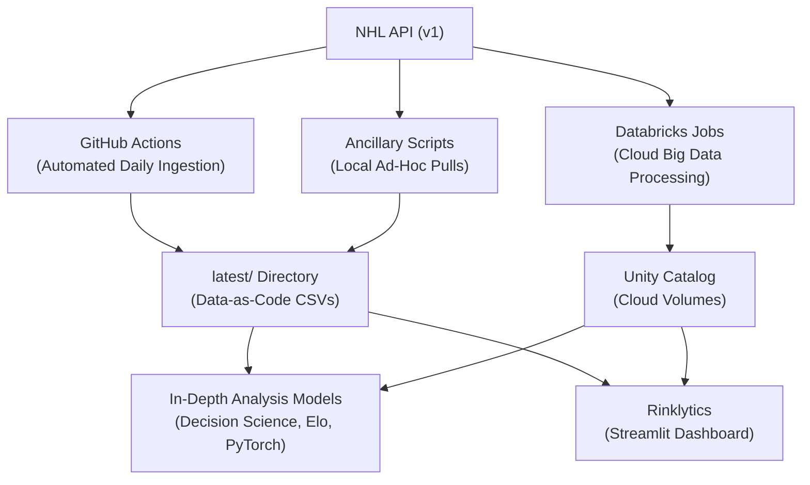

# NHL Analytics: Data Storage & Processing Architecture

The `latest/` directory serves as the primary "Data-as-Code" storage location for the NHL Analytics repository. It holds raw, parsed, and aggregated datasets collected from the NHL API. 

This repository leverages a hybrid execution architecture depending on the compute environment: **GitHub Actions** for daily data ingestion, **Databricks Jobs** for large-scale data engineering and analytics, and **Local Execution** for ad-hoc research and model building.

### Architecture Overview


---

## 📂 Directory Structure & Schema

The data is logically separated into four primary domains:

- **`box/`**: Game-level box scores, betting odds, and processed game summaries.
- **`play/`**: Event-level play-by-play records and shift charts mapping to game IDs.
- **`player/`**: Aggregated player statistics, goalie stats, and historical rosters.
- **`team/`**: Static team metadata, geographical locations, and SVG team logos.

Each subdirectory contains its own `readme.md` detailing the specific Python scripts used to populate it.

---

## ⚙️ Data Processing Workflows

### 1. Automated Daily Ingestion (GitHub Actions)
During the NHL season (Oct-Jun), a GitHub Actions CI/CD workflow runs daily at 20:00 UTC. 
- It executes the data extraction scripts located in `src/data/apinhle/`.
- New game data is downloaded and incrementally appended to the existing CSV/JSON files in this `latest/` directory.
- The updated files are automatically committed back to the repository, ensuring the data is always up-to-date for anyone cloning the project.

### 2. Cloud Orchestration (Databricks)
For intensive data engineering tasks and out-of-core analytics (e.g., Elo rating computations, PyTorch momentum models), the pipeline connects to a Databricks environment.
- The path configurations (`src/data/apinhle/config.py`) dynamically switch to Databricks Unity Catalog Volumes (e.g., `/Volumes/nhl-databricks/data/...`).
- Databricks Jobs execute Spark and DuckDB pipelines to process massive play sequences across the cluster.

### 3. Local Ad-Hoc Pulls
If you need real-time data outside of the automated 20:00 UTC schedule, you can manually trigger the data extraction scripts locally using the `uv` environment. 

Run these from the repository root:

* **Game Box Scores & Odds:**
  ```bash
  uv run python src/data/apinhle/data_pull_box.py
  uv run python src/data/apinhle/data_pull_box_odds.py
  ```
* **Play-by-Play & Shifts (requires Box Scores first):**
  ```bash
  uv run python src/data/apinhle/data_pull_plays.py
  uv run python src/data/apinhle/data_pull_lines.py
  ```
* **Player & Team Data:**
  ```bash
  uv run python src/data/apinhle/data_pull_player.py
  uv run python src/data/apinhle/data_ancillary.py
  ```

*The extraction scripts are designed to be incremental. They will identify the game IDs that already exist in the `latest/` folders and only download data for new games to prevent API throttling.*