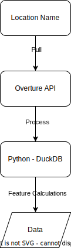

# Geospatial Data Pull
Using publicly available data sources to pull geospatial information.
 * Overture Foundation [Place of Interest Data](https://docs.overturemaps.org/guides/places/)

## Procedures

## Stadium Locations - Ad hoc Changes
Because the `Overture` data is not perfect and its more efficient to spot check 30-some locations and correct lat/lon of stadius, here are teams that I searched and fix the incorrect point locations.

 - BOS
 - CHI
 - DET
 - EDM
 - MTL
 - NSH
 - VGK